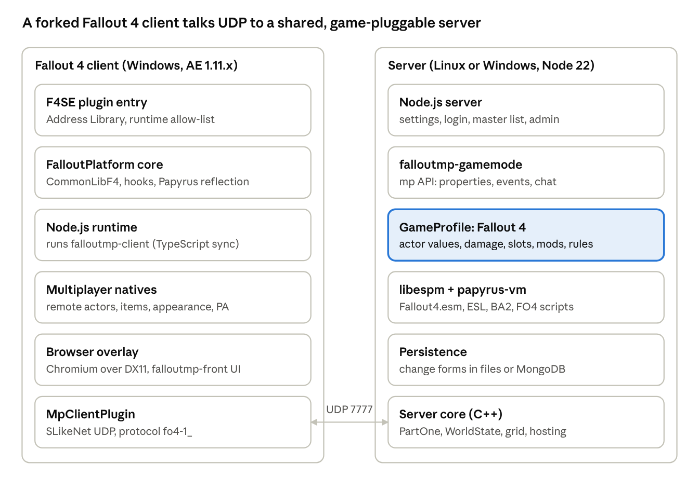
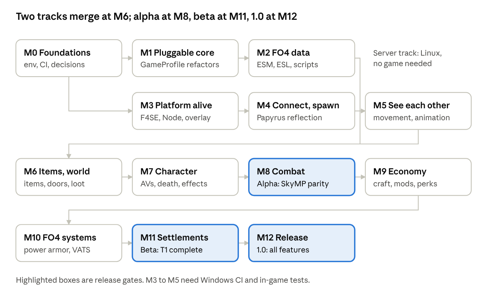

# FalloutMP — Master Project Plan

> This file summarizes the whole plan as of 2026-10-05. A shared copy is at https://claude.ai/code/artifact/460bdde8-af59-4b11-b427-0f67f30e9889
> Details live in this folder. Start at [README.md](README.md) and [STATUS.md](STATUS.md).

## Overview

FalloutMP turns this SkyMP fork into an open-source, server-authoritative multiplayer framework for Fallout 4 (Anniversary Edition 1.11.x). It reaches SkyMP parity at the M8 alpha, adds the Fallout 4 systems every server needs (T1) by the M11 beta, ships 1.0 at M12, and adds the T2 systems (VATS-lite, companions, quests, stealth, settlement attacks, survival) in 1.x. The schedule is computed from the task list (03-milestones.md capacity model): about 18–26 months to 1.0.

- **Repository:** `StrangerUndead/falloutmp`, branch `claude/fallout4-port-research`. The full plan is in `docs/falloutmp/`: 70+ files, 33 feature specs, and 645 tasks with IDs (422 feature tasks, 223 infrastructure tasks; counts from `tools/falloutmp-plan-stats.py`).
- **How sessions use it:** every session starts with `README.md` and `STATUS.md`, picks the next unblocked task of the current milestone, verifies it the way the task specifies, and updates STATUS.md.
- **Current state:** planning is complete. No code has changed yet; the repo is upstream SkyMP `f926944` plus the plan. Current milestone: **M0 Foundations**.

## Vision and scope

"Works as well as SkyMP" means three things:
- the same developer experience;
- the same sync standard for every feature ([01-sync-standard.md](01-sync-standard.md));
- every Fallout 4 system synced to that standard, not approximated ([00-vision-scope.md](00-vision-scope.md)).

**Player and admin journeys**
1. Install the client next to F4SE, connect, and log in (offline profile or a FalloutMP master server).
2. Create a character in the Fallout 4 face editor, with no Vault 111 intro, and spawn into a persistent Commonwealth.
3. See other players and NPCs move and animate in 1st and 3rd person, with modded weapons and power armor.
4. Loot containers, corpses and world items under server authority. Nothing duplicates, and the server evaluates leveled lists.
5. Fight with guns, melee and explosives. The server computes damage and validates hits with lag compensation.
6. Progress with XP, SPECIAL and perks. Craft, scrap, and mod weapons and armor at workbenches.
7. Use power armor, vendors, locks, terminals, companions and settlements. Live with server time and weather, map and fast-travel rules, and VATS-lite.
8. Admins run servers with JSON settings, JavaScript gamemodes, server Papyrus, database persistence and metrics.

**Parity: SkyMP feature → FalloutMP feature**

| SkyMP feature | SkyMP level | FalloutMP analogue | Target | Spec |
| --- | --- | --- | --- | --- |
| Movement | L3 | Movement, plus aim, power-armor and jetpack flags | L3+ | F01 |
| Animation events | L2–L3 | State, actions, events and graph variables | L3 | F02 |
| Appearance and RaceMenu | L3 | FO4 morphs, tints and head parts, edited in the face editor | L3 | F03 |
| Inventory | L4 | Item instances with weapon/armor mods (OMODs) and legendaries | L4 | F04 |
| Equipment | L3 | FO4 biped slots, layering, power armor pieces | L4 | F05 |
| Containers, pickup, drop | L4 | Same, plus corpse looting and quick loot | L4 | F06 |
| Doors, furniture, activation | L4 | Same, plus elevators, switches and power | L4 | F07 |
| Health, magicka, stamina | L3 | Health, Action Points, Rads, limbs, SPECIAL-derived values | L4 | F08 |
| Bow shots and hits | L3 | Guns, ammo, magazines, reload, lag-compensated hits | L4 | F09–F11 |
| Death and respawn | L4 | Same, plus bleedout and downed companions | L4 | F12 |
| NPC hosting | L3 | Same, plus FO4 spawn filters and threat-based host election | L3+ | F13 |
| Leveled lists, reloot | L4 | FO4 layouts, legendary rolls, cell reset | L4 | F14 |
| Forge crafting | L3–L4 | Component-based crafting at FO4 workbenches | L4 | F15 |
| Potions | L3 | Chems, food, addiction, radiation | L4 | F20 |
| Chat, console, names, custom properties | L3–L4 | Same, with a public default gamemode | L4 | F30, F31 |

**Fallout 4 systems with no SkyMP analogue.** These are synced to the same standard:
- weapon and armor modding (F16)
- power armor (F17)
- VATS-lite (F18)
- SPECIAL, perks and XP (F19)
- survival needs (F20)
- companions (F21)
- settlements (F22)
- vendors and caps (F23)
- locks, terminals and hacking (F24)
- time and weather (F25)
- map and fast travel (F26)
- quests and dialogue (F27)
- Pip-Boy, radio and HUD (F28)
- stealth (F29)

**Tiers.**
- T0 is SkyMP parity plus basic gunplay; it ships as the M8 alpha.
- T1 adds Fallout 4's identity (mods, power armor, perks, core settlements, vendors, locks); it ships as the M11 beta.
- T2 adds VATS-lite, companions, survival, settlement attacks and the quest framework; it ships as 1.0 at M12.

**Non-goals.** Co-op of the vanilla main quest; Game Pass, Epic, VR and consoles; peer-to-peer hosting.

**Quality targets (proposed).**
- SkyMP-class scale: about 1,000 concurrent players at 1.0 (SkyMP's compile-time cap is 1,000; production SkyMP servers have run 1,000+). Staged: 64 at the alpha, 300 at the beta, 1,000 at 1.0, with server tick p95 under 10 ms.
- No rubber-banding at 150 ms RTT.
- Hit false-reject rate under 2%.
- At most 20 KB/s per client with 30 actors visible.
- Zero item duplication or loss across disconnects and restarts.

## How SkyMP works and what carries over

SkyMP is three products stacked together. About 40% of its code is game-agnostic and is reused. The rest is rewritten or made game-aware.

| Component | What it does in SkyMP | For FalloutMP |
| --- | --- | --- |
| SkyrimPlatform | SKSE plugin that embeds Node.js and a Chromium overlay. It hooks the Papyrus VM so TypeScript can call any game function, and spawns the player by patching a template save | Forked as `fallout4-platform` on F4SE + CommonLibF4. Node, the overlay and the event plumbing carry over. Every engine address and hook is rewritten |
| skymp5-client | TypeScript client. Sends movement every 130 ms plus animation events. Remote actors are local NPC clones, and NPCs are "hosted" by a client | Forked as `falloutmp-client`. Networking, the world model, the service layer and hosting carry over. All sync modules are rewritten |
| skymp5-server | Node plus a C++ core: UDP networking, a 4096-unit grid with 3×3 visibility, server-side Papyrus, ESM loading, file/MongoDB persistence, JS gamemodes with veto events | Kept shared and game-pluggable through a `GameProfile` abstraction, so upstream fixes keep merging |
| libespm, papyrus-vm | Plugin parser and script VM | Gain FO4 record layouts, light plugins (ESL), and FO4 compiled scripts with structs, Var and 11 new opcodes |

**Key findings.**
- Fallout 4 Papyrus has neither `SendAnimationEvent` nor `KeepOffsetFromActor`, and SkyMP's animation and locomotion depend on both.
- The current parsers would crash on FO4 weapon and armor records.
- The script VM cannot read FO4 compiled scripts.
- The Linux server and tests build in about 25 minutes. Without game data, 138 of 171 tests pass.

## The Sync Standard

Every feature meets one contract, derived from SkyMP's own code:
- the server owns anything exploitable or persistent;
- every rejected request gets a correction sent back;
- every feature is unit-tested for accept, reject, late join and persistence.

Full text: [01-sync-standard.md](01-sync-standard.md).

| Authority class | Who decides | Examples |
| --- | --- | --- |
| A Server-authoritative | The server computes and stores; client requests are validated | Inventory, equipment, damage, actor values, XP, crafting, settlement objects, locks |
| B Owner-authoritative, validated | The owner client (or NPC host); the server checks plausibility before relaying | Movement, aim, animation, fire events |
| C Host-simulated | A client's local AI; the server checks host identity on every message | NPC movement and combat, companions |
| D Local cosmetic | Each client on its own | Radio, Pip-Boy UI, particles |

**Levels.**
- L1: visible.
- L2: synced; late joiners see it correctly.
- L3: authoritative; validated, corrected, persisted, and works for hosted NPCs.
- L4: complete; gamemode hooks, server Papyrus events, the full test matrix, and budgets met.

**Where FalloutMP deliberately goes beyond SkyMP.**
- Movement is validated before it is relayed.
- Reliable messages are ordered in both directions.
- Rejects are never silent.
- Melee reach is checked.
- Every regenerating actor value is cropped.
- Hosted NPCs get per-actor values.
- Deaths are broadcast to everyone nearby.
- Every interaction checks distance and occupancy.
- There is a single server clock.
- The binary reader is bounds-checked.

**Message registry.**
- IDs 1–33 stay byte-identical for Skyrim.
- IDs 34–63 are reserved for upstream SkyMP.
- IDs 64–79 are FO4 twins of existing messages.
- IDs 80–122 are new FO4 messages (allocated through 120 `PartyAction`; 121 reserved for a delta `SetInventoryFo4`; 122 free).
- FO4 uses the protocol prefix `fo4-1_`, so a Skyrim client can never join a Fallout server.

## Architecture and decisions

The server and shared libraries stay one codebase behind a GameProfile seam, and the client side is forked. See [02-architecture.md](02-architecture.md).

| ADR | Decision | Status |
| --- | --- | --- |
| 001 | Target Fallout 4 AE 1.11.x with F4SE 0.7.x, with a pinned runtime allow-list | Proposed |
| 002 | Game-pluggable shared server and libraries; forked client, platform and UI | Proposed |
| 003 | libxse/commonlibf4 pinned via two vcpkg overlay ports; both DLLs in Data/F4SE/Plugins | Proposed |
| 004 | Keep the embedded Node.js runtime | Accepted |
| 005 | Reuse the Chromium overlay (DX11 Present hook) | Proposed |
| 006 | Port runtime Papyrus reflection with struct and Var support | Proposed |
| 007 | World entry by template save plus teleport; .fos patcher as fallback | Proposed |
| 008 | Hybrid animation sync: state + actions + whitelisted events + named graph variables | Proposed (probe) |
| 009 | Freeze the Skyrim wire format; FO4 message twins at IDs 64+ | Accepted |
| 010 | Change forms plus new records for workshops and profiles | Proposed |
| 011 | Vanilla quests and scripts blocked by default, with an allow-list | Proposed |
| 012 | A server-side workshop service replaces the vanilla settlement scripts | Proposed |
| 013 | VATS disabled at T0; server-resolved VATS-lite at T2 | Proposed |
| 014 | Server-computed damage with lag-compensated hit validation | Proposed |
| 015 | Linux-first verification, Windows CI, in-game self-test | Accepted |
| 016 | Keep upstream licenses; decide on the Tilted UI code before release | Proposed |
| 017 | Offline mode first, then a FalloutMP master server | Proposed |
| 018 | Ship a public default gamemode | Accepted |
| 019 | Shared world loot by default; instanced loot as an option | Proposed |
| 020 | Server-authoritative XP, SPECIAL and perks | Proposed |
| 021 | Require/recommend existing mods (F4SE, Address Library, Buffout 4 NG, High FPS Physics Fix, LooksMenu, MCM) instead of re-implementing them | Accepted |

## Companion mods and dependencies

FalloutMP leans on existing, maintained Fallout 4 mods instead of rebuilding what they already do (ADR-021, [07-dependencies-and-mods.md](07-dependencies-and-mods.md)). Dependencies are installed by the player, verified by the client at connect, and every sync-critical path keeps a native fallback.

| Mod | Role in FalloutMP | Status |
| --- | --- | --- |
| F4SE 0.7.x | Script extender; loads the FalloutMP plugin | Required |
| Address Library for F4SE Plugins | Engine addresses by ID for the pinned game builds | Required |
| Buffout 4 NG | Crash logs for in-game test reports; engine memory and stability fixes | Strongly recommended |
| High FPS Physics Fix | Same physics at any frame rate, so projectiles, ragdolls and movement match across clients | Strongly recommended |
| LooksMenu | Face/body editor API, body morphs, appearance preset JSON as a candidate appearance format | Strongly recommended; native fallback kept |
| Mod Configuration Menu | In-game settings page | Recommended |
| HUDFramework, PrismaUI, Garden of Eden natives, Transfer Settlements, Workshop Framework | HUD widgets, alternative UI backend, extra script natives, settlement blueprint format, workshop hooks | Evaluate |

If ADR-006's reflection path holds (PLAT-030 prototype), any F4SE plugin that registers Papyrus natives is callable from client-side JS, so adding a native-extending mod costs almost nothing; under the fallback the natives are listed explicitly. The server defines the load order (enforceable by hash) and can allow or deny client DLL mods (SRV-003), which is a cooperation check for honest players; cheating is handled by server validation and anomaly scoring (SRV-005).

## Milestones

Estimates are computed from the task list with the capacity model in [03-milestones.md](03-milestones.md): size midpoints (S 1 day, M 1 week, L 4 weeks, XL 8 weeks), Linux-verifiable work at about 4× a solo developer, Windows-CI and in-game work at 1× and gated by the user's weekly test cadence. 1.0 covers T0 + T1; T2 systems ship in 1.x. With the two tracks in parallel that gives about 18–26 months to 1.0, with the parity alpha (M8) around month 9–12 and the beta (M11) at month 15–21. M1 runs beside M3 and M2 beside the platform half of M4; the M4 exit needs M1 and M2 done. The server track is Linux-only. The platform track needs Windows CI and in-game tests.

| Milestone | Exit criteria | Computed estimate |
| --- | --- | --- |
| M0 Foundations | A fresh-session bootstrap gives a green no-data test suite; fork CI builds fork code; every open question is answered or deferred | 1–2 weeks |
| M1 Pluggable core | Skyrim behaviour and packets are byte-identical; the server boots with game = fallout4; clients with the wrong protocol are refused | 4–6 weeks |
| M2 FO4 data | Synthetic fixture suites are green; Fallout4.esm and the DLCs load on the user's machine; FO4 compiled scripts execute | 5–8 weeks |
| M3 Platform alive | The plugin loads on allow-listed runtimes; JS hot reload, `tick` and the overlay work; the client connects; the animation probe starts in week 1 | 10–16 weeks |
| M4 Reflection, connect and spawn | `falloutPlatform.ts` is generated; Papyrus-safe `update` works; the player spawns at the persisted position with no vanilla quests running; the animation probe is analysed and ADR-008 decided | 8–12 weeks |
| M5 See each other | Two players see each other move and animate in 1st and 3rd person; server-spawned NPCs stand in the world; vanilla actors are cleaned up | 8–12 weeks |
| M6 Items and world | Inventory, equipment with mods, containers, corpse loot, doors (with lock state) and elevators reach their targets; the duplication suite is green | 8–12 weeks |
| M7 Character | Actor values are server-owned; death and respawn are broadcast; chems, radiation and XP persist | 7–10 weeks |
| M8 Combat (alpha) | Every parity row is at SkyMP level; gunfights work at 150 ms RTT; parties and friendly fire work; 64 hot-spot / 300 spread bots meet the targets | 10–14 weeks |
| M9 Economy | Crafting, scrap, modding, perks, vendors, locks, terminals, time/weather, map and PvP zones reach their targets | 10–14 weeks |
| M10 FO4 systems | Power armor works end to end; F20 T1 options are in (companions, VATS-lite, stealth and survival needs move to 1.x) | 6–9 weeks |
| M11 Settlements (beta) | 500 objects per settlement × 10 settlements persist and scale; every T1 feature is at target; 300-player load test passes | 10–14 weeks |
| M12 Release (1.0) | Every T0/T1 feature is at target; the soak test and the 1,000-player load test pass; docs and the licensing audit are done | 6–9 weeks |
| 1.x | T2 systems: VATS-lite, companions, quest framework, stealth, settlement attacks and supply lines, survival needs | after 1.0 |

## Feature catalogue

There are 32 specs with 406 tasks in [features/](features/). The authority codes are the classes defined above.

| ID | Feature | Authority and core design | Tier | Target | Milestone | Tasks |
| --- | --- | --- | --- | --- | --- | --- |
| F00 | Session, world entry, streaming | Login; template save + teleport; 3×3 grid streaming; save/load blocked | T0 | L4 | M4 | 11 |
| F01 | Movement and aim | B: 100 ms updates; validate-before-relay with a speed model; controller warp with a jitter buffer | T0 | L3+ | M5 | 9 |
| F02 | Animation | B: state keyframes, action replay, whitelisted events, named graph variables; prototype probe first | T0 | L3 | M5/M8 | 12 |
| F03 | Appearance, character creation | A: FO4 morphs, regions, tints, head parts; validated in the face editor; applied with Reset3D | T0 | L3 | M5/M7 | 13 |
| F04 | Inventory, item instances | A: item key = base + sorted mods + name + piece health + stolen flag | T0 | L4 | M6 | 15 |
| F05 | Equipment | A: biped slots 30–61, layering, weapon instances, power-armor lock | T0 | L4 | M6 | 13 |
| F06 | Containers, looting, drop | A: quick-loot peek, corpse loot, stealing, drops kept across restarts; loot shared or instanced | T0 | L4 | M6 | 14 |
| F07 | Activation, doors, furniture | A: load doors, elevators, switches, power gating; reach and occupancy checks | T0 | L4 | M6 | 15 |
| F08 | Actor values | A: Health, AP, Rads, limbs, SPECIAL-derived; every value cropped; per-actor values for NPCs | T0 | L4 | M7 | 15 |
| F09 | Ranged combat | B+A: server-owned ammo and magazines, fire-rate checks, hit validation with 250 ms rewind | T0 | L4 | M8 | 14 |
| F10 | Melee, explosives, turrets | A: reach check; server-side detonation and damage area; persisted mines; hosted turrets | T0/T1 | L4 | M8 | 14 |
| F11 | Damage model | A: FO4 resistance curve per damage type, limbs, crits, sneak, perk entry points | T0 | L4 | M8 | 11 |
| F12 | Death, respawn, bleedout | A: death broadcast, downed and revive, respawn points, optional death bag | T0 | L4 | M7 | 12 |
| F13 | NPC hosting and AI | C: per-NPC hosts with threat-based election and migration; essential NPCs invulnerable | T0 | L3+ | M5–M8 | 14 |
| F14 | Leveled lists, world respawn | A: seeded server rolls, legendary chance, cell reset, dropped-item lifetime | T0 | L4 | M6 | 14 |
| F15 | Crafting, components, scrap | A: component recipes, auto-scrapping of junk, workbench occupancy, perk gates | T1 | L4 | M9 | 13 |
| F16 | Weapon and armor modding | A: mods attached/detached for component costs; naming rules; stat resolver | T1 | L4 | M9 | 13 |
| F17 | Power armor | A: frames as server objects (pieces, health, paint, core charge); validated enter/exit | T1 | L4 | M10 | 14 |
| F18 | VATS | A: off by default; VATS-lite with server-resolved hits and no slowdown | T2 | L3 | M8/M10 | 12 |
| F19 | Progression | A: XP, levels, SPECIAL and perks as validated requests; bobbleheads; magazines | T1 | L4 | M7/M9 | 12 |
| F20 | Consumables, effects, survival | A: use-item; server effect system; addiction, radiation, optional survival needs | T1 | L4 | M7/M10 | 14 |
| F21 | Companions | C: owner-hosted followers, commands, per-player affinity | T2 | L3 | M10 | 10 |
| F22 | Workshop and settlements | A: WorkshopService with ownership, budgets, power simulation, chunked decor | T1/T2 | L4 | M11 / 1.x | 26 |
| F23 | Vendors, barter, trade | A: vendor stock and restock, barter formula, atomic player trade | T1 | L4 | M9 | 14 |
| F24 | Locks, terminals, hacking | A: server lock state; validated lockpick and hack outcomes; holotapes | T1 | L4 | M9 | 15 |
| F25 | Time and weather | A: one server clock, regional weather, radstorms, rest modes | T1 | L3 | M6/M9 | 11 |
| F26 | Map and fast travel | A: per-player discovery, validated fast travel | T1 | L3 | M9 | 10 |
| F27 | Quests and dialogue | A: vanilla quests blocked; gamemode quest and dialogue framework | T2 | L3 | M12 | 11 |
| F28 | Pip-Boy, radio, HUD | D/A: menus don't pause the game; synced light state; local radio | T1/T2 | L2/L3 | M5/M11 | 10 |
| F29 | Stealth | C+A: detection reports from hosts, Stealth Boy, sneak crits, pickpocketing | T2 | L3 | M10 | 10 |
| F30 | Chat, commands, admin | A: chat via the gamemode, console permissions, admin channel, ban store | T0 | L4 | M6 | 11 |
| F31 | Names and extensibility | A: nameplates, display names, custom properties, signed client snippets | T0 | L4 | M5 | 11 |
| F32 | Parties, teams, PvP rules | A: server-owned parties; one friendly-fire and hostility rule set; PvP flag, zones, XP sharing | T1 | L4 | M8/M9 | 9 |

## Infrastructure workstreams

The platform is the critical path. The server-side work runs in parallel on Linux. See [backlog/](backlog/).

| Workstream | Tasks | Scope |
| --- | --- | --- |
| PLAT | 48 | `fallout4-platform`: F4SE entry, Node runtime, tick, Papyrus reflection (struct and Var), events, overlay, multiplayer natives |
| ESPM | 20 | Game detection, ESL, FO4 records, strings from BA2, synthetic plugin builder |
| REF | 19 | Game-pluggability refactors; Skyrim stays green at every step |
| PVM | 16 | FO4 compiled-script reader, structs, Var, 11 opcodes, events, timers, server natives |
| SRV | 24 | Fallout4GameProfile, actor-value store, effects, perk engine, mod stats, lag compensation, clock, world reset |
| CLI | 16 | Client fork, settings, single-player systems off, world cleaner, TS test harness |
| NET | 13 | Protocol prefix, per-game registry, ordering, corrections, bounds checks, rate limits |
| ENV | 13 | Bootstrap, vcpkg workaround, fork CI, Windows CI, FO4 script fixtures |
| BUILD | 9 | CMake `GAME` switch, CommonLibF4 ports, client dist, BA2-capable archive library |
| QA | 11 | Self-test plugin, test scripts, load tests, network emulation, anti-dup suite |
| GM | 8 | Public default gamemode |
| FRONT, OPS, DOCS, DATA | 26 | UI theme, Docker/master server/releases, docs and licensing, `.fos` tools |

## Testing and verification

Claude verifies everything that can be checked on Linux. Windows code is compile-checked in CI. In-game behaviour is checked by the user, using a self-test plugin or short written scripts. See [04-testing-verification.md](04-testing-verification.md).

| Mode | What | Who |
| --- | --- | --- |
| L-unit | C++ unit tests that drive the server core | Claude |
| L-fixture | Parsers against synthetic plugins, scripts and BA2s (no Bethesda data) | Claude |
| L-ts | Client TypeScript against a mocked game API | Claude |
| L-int | A real server with scripted bot clients | Claude |
| W-ci | Windows MSVC build of the plugin and client | Claude, reading CI |
| G-self | The self-test plugin inside Fallout 4 writes a JSON report | User runs it, Claude reads it |
| G-manual | Written multiplayer scenarios | User |
| D-real | Tests against real Fallout4.esm/DLC files | User, locally |

Non-functional work:
- staged bot load tests: 64 hot-spot / 300 spread with 600 NPCs (M8), 300 (M11), 1,000 players with 2,000 NPCs (M12);
- jitter and packet-loss emulation;
- adversarial duplication tests;
- fuzzing of the binary reader;
- a 2-hour, 10-player soak test before 1.0.

## Risks and open questions

See [05-risks-open-questions.md](05-risks-open-questions.md).

| Risk | Likelihood | Impact | Mitigation |
| --- | --- | --- | --- |
| First-person animation: the 3rd-person graph is frozen in first person | High | High | Hybrid strategy; probe plugin first (F02-T01); parked-graph fallback |
| CommonLibF4 AE gaps (old vtable IDs, ~30 missing event sources) | High | High | RTTI vtable finder, local types, alandtse fallback |
| Bethesda patches break engine IDs | Medium | High | Runtime allow-list, ID-only addressing, fast refresh |
| Project size | High | High | Strict tiers, milestone exits, parallel tracks |
| In-game testing depends on the user's time | High | Medium | Self-test plugin, batched requests, two clients on one PC |
| Gun hits have no line-of-sight check (no server geometry) | High | Medium | Rewind, fire-rate and ammo checks, anomaly statistics |
| Settlement scale | Medium | High | Chunked decor, budgets, load tests |
| Power armor on remote actors is unsolved by prior art | Medium | High | Dedicated prototype in F17 |
| Tilted UI code is "All Rights Reserved" | Medium | Medium | Decide before public release (Q-04) |

**Decisions needed from the user**
- Q-02: the runtime target.
- Q-08: enabling GitHub Actions.
- Q-09: in-game testing cadence and Fallout4.esm availability.
- Q-14: essential NPCs spawned invulnerable.
- Q-06: priorities.
- Q-07: the template save.
- Q-10: the startup hook.
- Q-18: require (not just recommend) Buffout 4 NG, High FPS Physics Fix and LooksMenu?
- Also Q-01, Q-04, Q-05 and Q-15–Q-17.

## Lessons from prior projects

None of the earlier Fallout 4 multiplayer projects is server-authoritative. Details are in [reference/prior-art.md](reference/prior-art.md).

| Project | Takes | Avoids |
| --- | --- | --- |
| Commonwealth Online (server 1.1.0 and repo main) | Confirms the animation strategy. Also: re-syncing time after menu freezes, rate limits, the admin channel and ban store (F30-T11), server-list rules, systemd setup, bot scripts, weather IDs | Client-computed damage, a single world host, a 4-player cap, JSON over TCP |
| FO4_Wrld | Engine layouts, threat election with hysteresis, the parked-graph fallback | Bone streaming, raw addresses, ghosts that can't be hit |
| Fallout Together / TiltedEvolution | Remote-actor creation pattern, Reset3D face rebuild, the human animation descriptor | Its off-by-one IDs; the All Rights Reserved Tilted libraries |
| F4MP | Lessons only | Shared base NPC, placeatme spawning, client damage |

## Next steps

1. Get the user's answers to Q-02, Q-06, Q-08, Q-09, Q-10 and Q-14.
2. ENV-001…003: the bootstrap script, the vcpkg workaround and the build.sh fix, verified in a fresh container.
3. REF-000/001: tag the 33 data-dependent tests so the suite is green without Skyrim data.
4. ENV-016: add the upstream remote and do the first merge.
5. Start the M1 refactors (REF-002, REF-003) and the M2 plugin builder (ESPM-002) in parallel.
6. If available, get Commonwealth Online's client plugin source or their CommonLibF4 fork. Either would speed up the platform and animation work.
