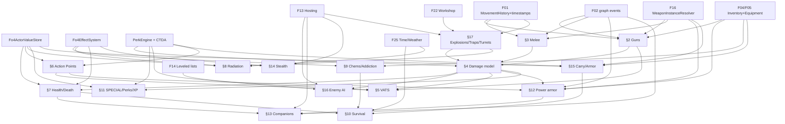

# Reference — Fallout 4 Combat & Character Systems (for FalloutMP)

> Scope: everything a FalloutMP implementer needs to sync Fallout 4 **combat** and **character** systems to the SkyMP Sync Standard (server-authoritative state, persistence, validation, gamemode hooks, server Papyrus, PartOne-style unit tests).
> Systems covered (one section each): guns, melee, damage model, VATS, Action Points, health/healing/death, radiation, chems/food/addiction/diseases, survival mode, SPECIAL/perks/XP, power armor, companions, stealth, carry weight/armor layering, enemy AI/creatures, explosions/traps/turrets. It ends with the cross-cutting protocol/state list (§19) and a dependency graph (§20).
> Feature specs that consume this doc: F05 equipment, F08 health/AP/rads, F09 guns, F10 melee/explosives, F11 damage, F12 death/respawn, F13 NPC hosting, F14 leveled lists, F17 power armor, F18 VATS, F19 progression, F20 chems/survival, F21 companions, F22 settlements (turrets), F29 stealth (IDs from [00-vision-scope.md](../00-vision-scope.md)).
> Written 2026-10-05. Fallout 4 target runtime: AE 1.11.x (see survey §3).

## How to read the provenance marks

| Mark | Meaning |
|---|---|
| `[src: <repo>/<path>:<line>]` | Verified in source. Repo keys below. Paths without a key are **this repo** (`/home/user/falloutmp`). |
| `[web: URL]` | Taken from an external page (fetched 2026-10-05). Re-check before relying on exact numbers. |
| `[inference]` | Our reasoning / design proposal, not verified. |
| **VERIFY** | A concrete thing the implementer must check against `Fallout4.esm` (D-real) or in game (G-self) before hard-coding. |

Repo keys (all public; the scratchpad clones used while writing are ephemeral, re-clone at these commits):

| Key | Repo @ commit | What was used |
|---|---|---|
| `f4se` | github.com/ianpatt/f4se @ `6f6a7ca` | `scripts/vanilla/*.psc` (vanilla Papyrus *signatures* F4SE ships) and `scripts/modified/*.psc` (F4SE-added natives) |
| `clf4` | github.com/libxse/commonlibf4 @ `7c8c6f8` | `include/RE/**` engine types (HitData, VATS, PowerArmor, BGSEntryPoint, ActorValue, …) |
| `xedit` | github.com/TES5Edit/TES5Edit branch `dev-4.1.6`, `Core/wbDefinitionsFO4.pas` | Record layouts (WEAP, AMMO, PROJ, EXPL, HAZD, ARMO, BPTD, PERK, ALCH, AMDL, DMGT, MGEF archetypes) |
| `fo4wrld` | github.com/ThePie88/FO4_Wrld @ `4200f32` | Prior art: PA pipeline RE, shared-HP NPC combat (targets 1.11.191, RVAs are build-specific) |

Main web sources: Fallout Wiki (fandom) pages read through the MediaWiki API (`https://fallout.fandom.com/api.php?action=parse&page=<Title>&prop=wikitext`), the Fallout 4 CK wiki API (`https://falloutck.uesp.net/w/api.php`). Full list in §21. Do **not** commit fetched wiki text or any game data (plan hard rule 1).

---

## 0. TL;DR — the decisions this document proposes

| # | Decision | Why |
|---|---|---|
| D1 | **Damage is always computed on the server** with a new `Fo4DamageFormula : IDamageFormula` implementing FO4's damage-vs-resistance curve, per-damage-type resolution, body-part multipliers, crits, sneak, perks, difficulty. Clients never apply damage to remote actors (ghosts are immortal/harmless as in SkyMP). | Same standard as SkyMP's `TES5DamageFormula` path [src: skymp5-server/cpp/server_guest_lib/ActionListener.cpp:1387] but FO4-correct. |
| D2 | **Shooter-detected hits, server-validated with lag compensation** ("SkyMP-plus"): every shot is announced (`WeaponFire`), every hit references a shot id (`CombatHit`), the server rewinds the target using a movement-history ring buffer and checks geometry, rate, ammo, range and cone. Validation level is a server setting (`off/basic/rewind`). | SkyMP trusts OnHit with cell/distance/cooldown checks only and has the reach check commented out [src: ActionListener.cpp:1049-1075, 1315-1334]. Guns need more. Quality target: rewind ≤ 250 ms, false-reject < 2 % at 150 ms RTT [00-vision-scope.md §7]. |
| D3 | **Ammo and magazines are server state**; shots are batched; the server sends `AmmoSync` only on mismatch (no per-shot inventory pushes). | Avoids the inventory race SkyMP already patches for crossbows [src: skymp5-client/src/services/services/playerBowShotService.ts:104-107]. |
| D4 | **Generic actor-value store keyed by AVIF form id** (base + permanent/temporary/damage modifiers, mirroring FO4's `ActorValueStorage`) replaces the Skyrim `ActorValues` struct in the FO4 GameProfile; `ChangeValues` gets an AV-map variant. | FO4 has ~130 hardcoded AVs plus ESM-defined ones [src: clf4 include/RE/A/ActorValue.h:57-197; A/ActorValueStorage.h; A/ACTOR_VALUE_MODIFIER.h]. |
| D5 | **Server-side effect system** for MGEF archetypes (Value/Peak Value Modifier, Stimpak, Damage, Invisibility, Chameleon, Stagger, Jetpack, Spawn Hazard, Cure Addiction…), generalising SkyMP's `ActiveMagicEffectsMap`. Chems, food, radiation, DoTs, legendary effects, survival all run on it. | SkyMP applies only potions/value effects [src: MpActor.cpp:1805-1920]; FO4 needs the full set [src: xedit wbDefinitionsFO4.pas:10124-10175]. |
| D6 | **Server-side perk engine** evaluating PERK entry points (158 of them) with CTDA conditions, so damage/AP/XP/stealth/carry rules match vanilla for every player (vanilla code paths only treat the single PlayerCharacter as "the player"). | [src: clf4 include/RE/B/BGSEntryPoint.h:7-165; xedit wbDefinitionsFO4.pas:7582-7690] |
| D7 | **No global time-slow.** VATS ships as (a) disabled, or (b) server-resolved "VATS-lite" without slowdown; Jet / Deadeye / Resolute time-slow effects are neutralised or converted by server rule. | One shared world clock; FO4 VATS slows time engine-wide [src: clf4 include/RE/V/VATS.h:62-63]. |
| D8 | **Power armor is a server object**: frame reference with inventory (pieces, OMODs, piece health, fusion core charge), occupancy like SkyMP furniture/containers, wearer state broadcast; remote rendering uses the engine's own PA enter pipeline on the ghost. | FO4_Wrld proved the approach on 1.11.191 [src: fo4wrld README.md:111; fw_native/src/hooks/pa_pipeline_trace.h:9-33]. |
| D9 | **Companions = player-owned NPCs hosted by their owner's client**; affinity, commands and inventory are server data; vanilla `FollowersScript`/`CompanionActorScript` quest logic is not run. | Those scripts hard-code `Game.GetPlayer()` everywhere [src: f4se scripts/vanilla/CompanionActorScript.psc:659-660; FollowersScript.psc:56]. |
| D10 | **Survival mode = a server rules module** (needs, diseases, adrenaline, carry/ammo weight, healing rates, fast-travel/saves), each rule individually toggleable in `server-settings.json`. | Vanilla survival is quest-script driven (`HC_Manager`) and assumes one player [inference]. |

---

## 1. Common foundations (used by every section)

### 1.1 SkyMP baseline (what exists today)

| Area | Code | Behaviour to keep / change |
|---|---|---|
| Hit message | `HitMessage::Data{aggressor,isBashAttack,isHitBlocked,isPowerAttack,isSneakAttack,projectile,source,target}` [src: skymp5-server/cpp/messages/HitMessage.h:17-40] | Too thin for FO4 (no limb, shot id, position, damage-type data). Add `CombatHit` (§19). |
| Hit validation | `ActionListener::OnHit` — aggressor is self or a hosted NPC (`worldState.hosters`), same cell/world, ≤ 4096 u unless bow, aggressor alive, weapon equipped or unarmed (`0x1f4`) [src: ActionListener.cpp:1006-1112] | Keep all of these; FO4 unarmed id must come from the profile (`0x1f4` is Skyrim's). |
| Attack cooldown | `CanHit`: `t ≥ 1.1/speed − 1.1/speed·(speed≤0.75 ? .45 : .3)` from WEAP speed [src: ActionListener.cpp:975-990]; splash window 0.1 s / max 4 targets [src: ActionListener.cpp:1269-1299] | Reuse for melee; guns use shot accounting instead. |
| Block | `ShouldBeBlocked`: target facing aggressor within 1 rad; requires `IsBlockActive` (from `blockStart`/`blockStop` anim events and movement `isBlocking`) [src: ActionListener.cpp:992-1003, 1340-1385; AnimationSystem.cpp:12-33] | Reuse for FO4 melee block. |
| Damage formula | `IDamageFormula` interface [src: formulas/IDamageFormula.h:7-19]; `TES5DamageFormula` (power ×2, blocked ×0.1, sneak ×1.3, armor via `fArmorScalingFactor`/`fMaxArmorRating`) [src: formulas/TES5DamageFormula.cpp:127-166]; decorators `DamageMultFormula`, `DamageMultConditionalFormula` [src: formulas/DamageMultConditionalFormula.h:92-117]; installed by `PartOne::SetDamageFormula` [src: PartOne.cpp:131,484-500] | Add `Fo4DamageFormula`; keep decorators (gamemode-configurable PvP multipliers). |
| AV regen check | client sends health/magicka/stamina **percentages**; server crops increases by `rate × rateMult × dt` [src: CropRegeneration.cpp:21-66; ActionListener.cpp:765-830] | Generalise per AV (Health, AP, limb conditions); Rads only increase from client. |
| Death/respawn | `SetPercentage(Health ≤ 0)` → `Kill` → `DeathStateContainer{tTeleport,tChangeValues,tIsDead}`; `RespawnWithDelay(spawnDelay=25 s)`; gamemode `onDeath`, `onRespawn` [src: MpActor.cpp:647-675, 1003-1059, 1327-1434; MpChangeForms.h:105-109] | Keep; add downed/bleedout option (§7). |
| Client death handling | local player in `startDeferredKill`; `KillMove*` and `staggerStart` blocked on remote actors [src: skymp5-client/src/services/services/deathService.ts:24-58] | Same in FO4 (`Actor.StartDeferredKill` exists [src: f4se scripts/vanilla/Actor.psc:770]). |
| Client hit capture | `hitService` sends OnHit only if aggressor is the player or a hosted NPC [src: skymp5-client/src/services/services/hitService.ts:15-35] | Same filter; ghosts' own projectiles never cause hits. |
| Papyrus OnHit | server sends Skyrim 7-arg `OnHit`, projectile = None [src: ActionListener.cpp:1410-1425]; gamemode sees it as `onPapyrusEvent:OnHit` (blocking only stops the Papyrus dispatch, not damage) [src: gamemode_events/PapyrusEventEvent.cpp:17-57; MpForm.cpp:34-40] | FO4 needs a 9-arg OnHit with registration semantics (§1.5) and a real blockable `onHit`. |
| Hosting | `Host` request, 2 s reset timeout, `HostStart/HostStop`, `EquipBestWeapon` on host change [src: ActionListener.cpp:653-738] | Basis of NPC combat (§16). |
| Movement | `UpdateMovement` (pos, rot, direction, health %, speed, runMode, jump/sneak/block/weapDrawn/dead flags, lookAt) 130 ms [src: messages/UpdateMovementMessage.h:20-50]; teleport check ≥ 4096 u [src: MovementValidation.cpp:17-34]; last update time per idx [src: ActionListener.cpp:177-183] | Add client timestamp, server timestamp on forward, FO4 flags; store history ring buffer (§1.7). |
| Tests | Catch2, `GetPartOne()`, `DoConnect`, `CreateActor(0xff000000,…)`, `SetUserActor`, call `GetActionListener().OnHit(raw,msg)`, check `p.Messages()` and change form [src: unit/HitTest.cpp:22-55] | Use the same harness for every test listed below. |

### 1.2 FO4 actor values used in this document

Form IDs are in `Fallout4.esm` (hardcoded AVIFs live at `0x2BC–0x39C`) [web: https://fallout.fandom.com/wiki/Fallout_4_console_commands §Character variables]. The engine's own pointer list (field names) is in [src: clf4 include/RE/A/ActorValue.h:57-197]. **VERIFY** every id with libespm against Fallout4.esm before hard-coding (put them in the FO4 GameProfile table, never inline).

| AVIF EDID | Form ID | Role | | AVIF EDID | Form ID | Role |
|---|---|---|---|---|---|---|
| Strength … Luck | `2C2`…`2C8` | SPECIAL (S `2C2`, P `2C3`, E `2C4`, C `2C5`, I `2C6`, A `2C7`, L `2C8`) | | Experience | `2C9` | XP pool |
| Health | `2D4` | HP | | ActionPoints | `2D5` | AP |
| HealRate | `2D7` | HP regen | | ActionPointsRate | `2D8` | AP regen |
| ConditionRate | `2D9` | limb regen | | SpeedMult | `2DA` | move speed % |
| RadsRate | `2DB` | rad decay | | CarryWeight | `2DC` | capacity |
| CritChance | `2DD` | non-VATS crit % (100 = always) | | MeleeDamage / UnarmedDamage | `2DE` / `2DF` | |
| Mass | `2E0` | | | Rads | `2E1` | radiation poisoning |
| DamageResist | `2E3` | ballistic DR | | PoisonResist | `2E4` | |
| FireResist / ElectricResist / FrostResist | `2E5`/`2E6`/`2E7` | | | MagicResist | `2E8` | (unused) |
| RadResistIngestion / RadResistExposure | `2E9` / `2EA` | | | EnergyResist | `2EB` | ER |
| RadHealthMax | `2EE` | max HP after rads | | PowerArmorHead/Torso/LeftArmCondition | `2EF`/`2F0`/`2F1` | PA piece condition |
| Paralysis / Invisibility | `2F2` / `2F3` | | | IgnoreCrippledLimbs | `2F8` | |
| WeapReloadSpeedMult | `2D3` | | | WeaponSpeedMult | `312` | |
| MovementNoiseMult | `319` | stealth | | CombatHealthRegenMult | `343` | |
| FollowerState/Distance/Stance | `344`/`345`/`346` | companions | | Fatigue | `34F` | survival AP loss |
| RadsRateMult | `355` | | | AttackDamageMult | `357` | (set 0 on ghosts) |
| HealRateMult / ActionPointsRateMult / ConditionRateMult | `358`/`359`/`35A` | | | AimStability | `35B` | scope sway |
| PowerArmorBattery | `35C` | worn core charge | | PowerArmorRightArm/LeftLegCondition | `35D`/`35E` | |
| ReflectDamage | `35F` | | | PerceptionCondition (head) | `36C` | limb |
| EnduranceCondition (torso) | `36D` | limb | | LeftAttackCondition / RightAttackCondition | `36E` / `36F` | arms |
| LeftMobilityCondition / RightMobilityCondition | `370` / `371` | legs | | BrainCondition | `372` | limb (effect unknown) |
| AttackConditionAlt1/2/3 | `2CA`/`2CB`/`2CF` | creature limbs | | PowerArmorRightLegCondition | `388` | |
| CriticalHitDamageMult | `39C` | crit dmg × | | ArmorPenetration (ESM AV) | `97341` | % DR ignored |
| CA_Affinity / CA_CurrentThreshold | `A1B80` / `A1B81` | companion | | DetectionMovementMod / FallingDamageMod / ReduceLimbDamageMod / MineTriggerRangeMod / ChemDurationMod | `BA43C`/`BA43D`/`BA43E`/`BA43F`/`BA447` | perk helper AVs |

Not listed in the public table: `FatigueAPMax`, restore-fatigue rate and `FatigueRateMult` exist in the engine list [src: clf4 include/RE/A/ActorValue.h (fatigueAPMax, restoreFatigueRate, fatigueRateMult)] — ids unknown (probably in `350–354`), **VERIFY**. Hunger/thirst/sleep are **not** AVs in vanilla survival (script state) [inference].

AV types/flags (Attribute, Skill, Resistance, Condition, Charge, Resource…; Min1/Max10/Max100, DamageIsPositive, GodModeNoDamage, DoesNotRecover…) [src: clf4 include/RE/A/ActorValue.h:12-50]. FO4 stores per actor `baseValues[(avFormId, float)]` and `modifiers[(avFormId, {permanent, temporary, damage})]` [src: clf4 include/RE/A/ActorValueStorage.h; A/ACTOR_VALUE_MODIFIER.h]. Current value = base + permanent + temporary + damage (damage ≤ 0) [inference].

### 1.3 Records and fields (from `xedit`)

| Record | Fields that matter for combat/character | Source |
|---|---|---|
| WEAP `DNAM` | Ammo; Speed; Reload Speed; Reach; Min Range; Max Range; Attack Delay; Damage-OutOfRange Mult (default 0.5); On Hit (hit behaviour); Skill AV; Resist AV; Flags (Player Only, NPCs Use Ammo, No Jam After Reload, Charging Reload, Minor Crime, Fixed Range, Not Used In Normal Combat, Crit Effect on Death, Charging Attack, Hold Input To Power, Non Hostile, Bound, Ignores Normal Weapon Resistance, Automatic, Repeatable Single Fire, Can't Drop, Hide Backpack, Embedded, Not Playable, Has Scope, Bolt Action, Secondary Weapon, Disable Shells); Capacity (u16); Animation Type (HandToHand…Gun, Grenade, Mine); Damage-Secondary; Weight; Value; Damage-Base (u16); Sound Level; sounds; Accuracy Bonus; Animation Attack Seconds; Action Point Cost (default 20); Full Power Seconds; Min Power Per Shot; Stagger | [src: xedit wbDefinitionsFO4.pas:12910-12990] |
| WEAP `FNAM` | Animation Fire Seconds; rumble; Animation Reload Seconds; Bolt Anim Seconds; Sighted Transition Seconds (0.25); # Projectiles (1); Override Projectile | [src: xedit :12991-13008] |
| WEAP other | `CRDT` Crit Damage Mult (default 2.0), Crit Charge Bonus, Crit Effect SPEL; `INAM` impact set; `LNAM` NPC Add Ammo List; `WAMD` Aim Model; `WZMD` Zoom; `DAMA` damage types; `MASE` melee speed (Very Slow…Very Fast); `NNAM` embedded OMOD; `INRD` instance naming | [src: xedit :13009-13030, 12904] |
| AMMO `DNAM` | Projectile; Flags (Ignores Normal Weapon Resistance, Non-Playable, Has Count Based 3D); Damage; **Health** (used by fusion cores) | [src: xedit :5765-5775] |
| PROJ `DNAM` | Flags (**Hitscan**, Explosion, Alt. Trigger, Muzzle Flash, Can Be Disabled, Can Be Picked Up, Supersonic, Pins Limbs, Disable Combat Aim Correction, Penetrates Geometry, Continuous Update, Seeks Target); Type (Missile, Lobber, Beam, Flame, Cone, Barrier, Arrow); Gravity; Speed; Range; explosion proximity/timer; Explosion; Fade; Impact Force; Cone Spread; Collision Radius; Lifetime; Relaunch Interval; Tracer Frequency; VATS Projectile | [src: xedit :7121-7172] |
| EXPL `DATA` | Placed Object; Spawn Projectile; Force; Damage; Inner Radius; Outer Radius; Flags (Knock Down Always/By Formula, Ignore LOS Check, Push Source Only, Chain, Placed Object Persists…); Sound Level; Stagger; Spawn (x,y,z,spread,count) | [src: xedit :7341-7382] |
| HAZD `DNAM` | Limit; Radius; Lifetime; Target Interval (0.3 s); Flags (Affects Player Only, Inherit Duration/Radius, Align to Normal, Drop to Ground, Taper Effectiveness); Effect (SPEL/ENCH); taper | [src: xedit :7180-7208] |
| ARMO | `DATA` Value, Weight, **Health** (PA pieces break at 0); `FNAM` Armor Rating (= ballistic DR), Base Addon Index, Stagger Rating; `DAMA` resistances per DMGT; `BOD2` biped slots | [src: xedit :5786-5847] |
| BPTD `BPND` | Damage Mult; Flags (Severable, Hit Reaction, Explodable, Cut-Meat Cap Sever, On Cripple, Explodable-Absolute Chance, Show Cripple Geometry); Part Type (LIMB_ENUM); **Health Percent**; **Actor Value** (limb condition AV); **To Hit Chance** (VATS); Explosion Chance; Non-Lethal Dismemberment Chance; cripple art/debris | [src: xedit :7693-7770; clf4 include/RE/P/PART_DATA.h] |
| PERK | `DATA` Trait, Level, Num Ranks, Playable, Hidden; `NNAM` Next Perk (each rank is a separate PERK form); `CTDA` level-up conditions; entries: `PRKE` (type Quest/Ability/EntryPoint, rank, priority), `DATA` (entry point id, function), `PRKC`+`CTDA` per condition tab, `EPFT` param type, `EPFB` entry id, `EPF2/EPF3`, `EPFD` data, `PRKF` end | [src: xedit :7582-7690] |
| ALCH `ENIT` | Value; Flags (Food Item, Medicine, Poison); **Addiction** form; **Addiction Chance**; consume sound; `DNAM` addiction name; effects | [src: xedit :5691-5739] |
| AMDL `DNAM` | Cone of fire min/max angle, increase per shot, decrease per sec, decrease delay ms, sneak mult, iron-sights mult; recoil spring force, sights mult, max/min per shot, hip mult, runaway shots, arc, arc rotate; base stability | [src: xedit :12246-12266] |
| DMGT `DNAM` | array of {resistance AV, SPEL} | [src: xedit :12310-12320] |
| MGEF archetypes | Value Modifier 0 … Invisibility 11 … Paralysis 21 … Cure Addiction 28 … Concussion 30, **Stimpak 31**, Accumulate Magnitude 32, **Stagger 33**, Peak Value Modifier 34, Cloak 35, **Slow Time 37**, Rally 38, Enhance Weapon 39, **Spawn Hazard 40**, Damage 45, Immunity 46, **Jetpack 48**, **Chameleon 49** | [src: xedit :10124-10175] |
| OMOD property targets | Numeric target ids and operators (Set 0, Add 1, Mul+Add 2, And 3, Or 4, Rem 5): e.g. Weapon fSpeed 0, fReach 1, fMin/MaxRange 2/3, fAttackDelaySec 4, fOutOfRangeDamageMult 6, fCriticalChargeBonus 8, iAmmoCapacity 12, bAutomatic 25, iAttackDamage 28, aim model 33-47, bHasScope 48, uNumProjectiles 51, poAmmo 61, fReloadSpeed 76, vdDamageTypeValues 77, fAttackActionPointCost 79, ppOverrideProjectile 80, fFullPowerSeconds 84, fCriticalDamageMult 90, bChargingAttack 93, vaActorValues 94; Armor fWeight 260, iRating 262, vdDamageTypeValues 265, vaActorValues 266, iHealth 267; Actor pkKeywords 512, iXPOffset 514 | [src: f4se scripts/modified/ObjectMod.psc:1-172] |

`InstanceData` natives (F4SE) read the *effective* (OMOD-applied) weapon/armor stats on the client — useful for G-self parity tests against the server's OMOD evaluator: `GetAttackDamage`, `GetDamageTypes`, `GetAmmoCapacity`, `GetAmmo`, `GetActionPointCost`, `GetAttackDelay`, `GetReloadSpeed`, `GetReach`, `GetMin/MaxRange`, `GetSpeed`, `GetStagger`, `GetCritMultiplier`, `GetCritChargeBonus`, `GetProjectileOverride`, `GetNumProjectiles`, `GetFlag` (Automatic `0x4000`, ChargingReload `0x8`, ChargingAttack `0x10000`, BoltAction `0x400000`…), `GetArmorHealth`, `GetArmorRating` [src: f4se scripts/modified/InstanceData.psc:3-124].

### 1.4 Engine hooks inventory (client side, CommonLibF4)

| Need | Type / function | Source |
|---|---|---|
| Hit details | `TESHitEvent{hitData, target, cause, material, sourceFormID, projectileFormID, usesHitData}`; `HitData{impactData(location, normal, velocity), aggressor, target, sourceRef, attackData, weapon instance, criticalEffect, hitEffect, VATSCommand, ammo, damageTypes, healthDamage, totalDamage, physicalDamage, targetedLimbDamage, percentBlocked, resistedPhysicalDamage, resistedTypedDamage, stagger, sneakAttackBonus, bonusHealthDamageMult, pushBack, reflectedDamage, criticalDamageMult, flags, equipIndex, material, damageLimb}`; flags kBlocked, kBlockWithWeapon, kCritical, kCriticalOnDeath, kFatal, kDismemberLimb, kExplodeLimb, kCrippleLimb, kDisarm, kDisableWeapon, kSneakAttack, kIgnoreCritical, kBash, kTimedBash, kPowerAttack, kMeleeAttack, kRicochet, kExplosion | [src: clf4 include/RE/T/TESHitEvent.h:9-29; H/HitData.h:20-79] |
| Shot launch | `ProjectileLaunchData{origin, contactNormal, projectileBase, shooter, fromWeapon, fromAmmo, equipIndex, z/x/yAngle, homingTarget, parentCell, area, power, scale, coneOfFireRadiusMult, targetLimb, alwaysHit, autoAim, forceConeOfFire, intentionalMiss, penetrates…}`; `Projectile` members `shooter, velocity, power, damage, range, weaponSource, ammoSource, targetLimb`; vfuncs `AddImpact`, `HandleHits` | [src: clf4 include/RE/P/ProjectileLaunchData.h; P/Projectile.h:99-163]. The launch function itself is not exposed in libxse → RE task |
| Ammo / reload | `Actor::UseAmmo(weapon, equipIndex, shotCount)` vfunc 0xF0, `Actor::ReloadWeapon` 0xEF, `GetCurrentAmmo/GetCurrentAmmoCount/SetCurrentAmmoCount`, `EquippedWeaponData::ammoCount`; HUD events `PlayerAmmoCountEvent{clipAmmo, reserveAmmo}`, `PlayerWeaponReloadEvent(bool)`; `GUN_STATE` (Drawn, Relaxed, Blocked, Alert, Reloading, Throwing, Sighted, Fire, FireSighted) via `Actor::SetGunState` | [src: clf4 include/RE/A/Actor.h:173-174, 305-324, 521-534; E/EquippedWeaponData.h:35; P/PlayerAmmoCounts.h; G/GUN_STATE.h] |
| Aim state | `AimModel{aimModelData, recoil springs, fireConeSize, continuousShots}`; `Actor::GetAimVector`, `GetCurrentFireLocation` | [src: clf4 include/RE/A/AimModel.h; A/Actor.h:277,324] |
| Damage math (reference values for tests) | `CombatFormulas::CalcWeaponDamage(avOwner, instance, ammo, condition, rangeMult)`, `CalcResistedPercentage(resistAV, damage, resistance)`, `CalcTargetedLimbDamage`, `GetWeaponDisplayRateOfFire`, `CalcScopeSteadyActionPointDrain` | [src: clf4 include/RE/C/CombatFormulas.h] |
| Apply / kill | `Actor::HandleHealthDamage` 0x110, `KillImpl` 0x117, `DoHitMe(HitData*)`, `RewardExperience`, `ForEachPerkEntry`, `CalculateDetectionFormula`, `Reset3D`, `IsCrippled` | [src: clf4 include/RE/A/Actor.h:202,206,213,410,500-510,619-626] |
| VATS | `VATS` singleton (commands, mode, `magicTimeSlowdown`, `playerMagicTimeSlowdown`, `VATSTarget`, `killCount`); `VATSCommand{action, target, limb, hitdata, actionPointCost, damageMult, fireShots, flags nextShotCausesCritical/spendCriticalCharge/attackChanceHit…}`; `VATSEvents::ModeChange`; `ActionPoints::Action` enum | [src: clf4 include/RE/V/VATS.h:20-80; V/VATSCommand.h; V/VATSEvents.h; A/ActionPoints.h] |
| Player progression | `PlayerCharacter::perkCount`, `vatsCriticalCharge`, `vatsCriticalCount`, `maxVATSCriticalCount`, `lastUsedPowerArmor`, `SelectPerk`, `SetPerkCount`, `SetVATSCriticalCount`, `GetDifficultyLevel`; `LevelIncrease::Event{newLevel}`, `PerkPointIncreaseEvent{perkCount}`, `XPChangeData` | [src: clf4 include/RE/P/PlayerCharacter.h:179-298, 459-486; L/LevelIncrease.h; P/PerkPointIncreaseEvent.h; X/XPChangeData.h] |
| Power armor | `PowerArmor::ActorInPowerArmor`, `GetArmorKeyword`, `GetBatteryKeyword`, `GetDefaultBatteryObject`, `IsPowerArmorBattery`, `SyncFurnitureVisualsToInventory`, `GetNewBatteryCapacity` (GMST `fNewBatteryCapacity`); extra data `kPowerArmor` (0xBB), `kInactivePowerArmor`, `kPowerArmorPreload`; menus `PowerArmorModMenu`, `PowerArmorHUDMenu` | [src: clf4 include/RE/P/PowerArmor.h:12-64; E/EXTRA_DATA_TYPE.h:66,194,212; P/PowerArmorModMenu.h] |
| Events GameScript forwards to Papyrus (all usable as sinks) | TESHitEvent, TESDeathEvent, TESDeferredKillEvent, TESEnterBleedoutEvent, TESLimbCrippleEvent, TESCombatEvent, TESEnterSneakingEvent, TESFurnitureEvent, TESSwitchRaceCompleteEvent, TESMagicEffectApplyEvent, TESActiveEffectApplyRemoveEvent, TESTrapHitEvent, TESCommandMode{Enter,Exit,GiveCommand,CompleteCommand}Event, TESConsciousnessEvent, BGSRadiationDamageEvent, BGSOnPlayerFireWeaponEvent, BGSOnPlayerHealTeammateEvent, BGSOnPlayerFallLongDistances, BGSOnPlayerModArmorWeaponEvent, BGSOnPlayerUseWorkBenchEvent, PlayerDifficultySettingChanged::Event … | [src: clf4 include/RE/G/GameScript.h (sink list)] |
| Other value events | `CurrentRadiationSourceCount`, `CurrentRadsDisplayMagnitude`, `CurrentRadsPercentOfLethal`, `PlayerCommandTypeEvent(COMMAND_TYPE)`, `TerminalHacked::Event`, `LocksPicked::Event`, `Bleedout::Event`, `DetectionEvent` | [src: clf4 include/RE/C/CurrentRad*.h; P/PlayerCommandTypeEvent.h; T/TerminalHacked.h; L/LocksPicked.h; B/Bleedout.h] |
| Menus (RTTI names) | VATSMenu, LevelUpMenu, SPECIALMenu, PipboyMenu, ScopeMenu, PowerArmorModMenu, PowerArmorHUDMenu, RobotModMenu, ExamineMenu, CookingMenu, SleepWaitMenu, SitWaitMenu, FavoritesMenu, BookMenu, LooksMenu… ; flag `kPausesGame` = bit 0 | [src: clf4 include/RE/IDs_RTTI.h; U/UI_MENU_FLAGS.h] |
| Difficulty enum | VeryEasy 0, Easy 1, Normal 2, Hard 3, VeryHard 4, Survival 5 (defunct), TrueSurvival 6 | [src: clf4 include/RE/D/DifficultyLevel.h; f4se scripts/vanilla/Game.psc:120-128] |

### 1.5 Papyrus surface (signatures; server Papyrus must implement the FO4 versions)

- **OnHit is registration-based and one-shot** in FO4: `RegisterForHitEvent(akTarget, akAggressorFilter, akSourceFilter, akProjectileFilter, aiPowerFilter, aiSneakFilter, aiBashFilter, aiBlockFilter, abMatch)`; "Objects without registrations CANNOT receive hit events"; event `OnHit(akTarget, akAggressor, akSource, akProjectile, abPowerAttack, abSneakAttack, abBashAttack, abHitBlocked, asMaterialName)` [src: f4se scripts/vanilla/ScriptObject.psc:90-98, 281-283]. Same model for `RegisterForMagicEffectApplyEvent`/`OnMagicEffectApply` and `RegisterForRadiationDamageEvent`/`OnRadiationDamage(akTarget, abIngested)` [src: ScriptObject.psc:106,123,297,325]. Vanilla scripts re-register inside the handler (e.g. FollowersScript re-registers radiation [src: f4se scripts/vanilla/FollowersScript.psc:303]). The server VM's event dispatcher must keep a per-target registration list with filters and consume it on dispatch [inference].
- Actor events used here: `OnCombatStateChanged` 845, `OnCommandMode*` 860-883, `OnCompanionDismiss` 887, `OnCripple(akActorValue, abCrippled)` 895, `OnPartialCripple` 972, `OnDeferredKill` 900, `OnDying` 920, `OnDeath` 904, `OnKill` 952, `OnEnterBleedout` 924, `OnEnterSneaking` 928, `OnDifficultyChanged` 916, `OnPlayerFireWeapon` 992 (comment: "fires a weapon **out of combat and based on timer**" — not per shot), `OnPlayerHealTeammate` 996, `OnPlayerFallLongDistance` 988, `OnRaceSwitchComplete` 1020 [src: f4se scripts/vanilla/Actor.psc:<line>].
- Natives used here (Actor.psc line): AddPerk 47, AllowBleedoutDialogue 53, EndDeferredKill 111, GetCombatState 173, GetCombatTarget 176, GetEquippedWeapon 206, GetLevel 249, HasDetectionLOS 295, HasPerk 307, IsBleedingOut 337, IsDetectedBy 352, IsEssential 364, IsInIronSights 385, IsInPowerArmor 391-393 (= `HasPerk(0x0001F8A9)`), IsSneaking 437, IsSprinting 440, Kill 455, KillEssential 458, Dismember 496, RemovePerk 535, ResetHealthAndLimbs 541, Resurrect 544, SetCommandState 616, SetCanDoCommand 622, SetCriticalStage 668, SetEssential 681, SetNoBleedoutRecovery 714, SetNotShowOnStealthMeter 717, SetPlayerTeammate 734, SetProtected 737, StartCombat 767, StartDeferredKill 770, StopCombat 779, SwitchToPowerArmor 785, WornHasKeyword 814. ObjectReference: DamageValue 287, GetBaseValue 372, GetValue 510, GetValuePercentage 513, ModValue 656, RestoreValue 777, SetValue 934, IgnoreFriendlyHits 565, KnockAreaEffect 642, PushActorAway 730, ProcessTrapHit 727, CreateDetectionEvent 281, AttachModToInventoryItem 233, GetItemHealthPercent 416, PlaceAtMe 683; events OnTrapHitStart/Stop 1111/1116, OnDestructionStageChanged 1017 [src: f4se scripts/vanilla/ObjectReference.psc:<line>]. Game: AddPerkPoints 7, GetXPForLevel 88, GetDifficulty 128, IsVATSControlsEnabled 214, IsVATSPlaybackActive 217, RewardPlayerXP(amount, abDirect) 294 (direct = ignore entry points and INT), ShowSPECIALMenu 345 [src: f4se scripts/vanilla/Game.psc]. Weapon: `Fire(akSource, akAmmo)` 4, `GetAmmo()` 7 [src: f4se scripts/vanilla/Weapon.psc]. Perk: `Event OnEntryRun(auiEntryID, akTarget, akOwner)` [src: f4se scripts/vanilla/Perk.psc:3-4].
- F4SE extras for the client: `Actor.GetWornItem/GetWornItemMods/QueueUpdate/GetFurnitureReference/IsProtected` [src: f4se scripts/modified/Actor.psc:13-34]; `Game.GetCameraState()` (2 = VATS, 4 = iron sights, 9 = furniture) [src: f4se scripts/modified/Game.psc:27-42]; `Perk.IsPlayable/GetLevel/GetNumRanks/GetNextPerk/IsEligible` [src: f4se scripts/modified/Perk.psc:3-24].

### 1.6 Single-player assumptions that break everywhere

1. **Global time scaling** (VATS, Jet, Deadeye/Resolute legendary, `Slow Time` MGEF archetype 37). One world clock ⇒ forbidden; neutralise per §5.
2. **Pausing menus** (`kPausesGame`): the local game freezes but the server world does not; the paused player's actor stays vulnerable. Healing from a paused Pip-Boy must be applied over time server-side (stimpak is already a 5 s effect) and optionally blocked in combat (gamemode rule).
3. **"The player" is one actor**: perks, XP (`RewardPlayerXP`), VATS, crit meter, companions (`Game.GetPlayer()`), sneak meter, survival, difficulty multipliers (player vs non-player) all assume a single PlayerCharacter. In MP every user actor is "a player" on the server; on a client only the local actor is the `PlayerCharacter`, remote players are ghost Actors. ⇒ All of these rules are evaluated on the server.
4. **Local hit detection against stale ghosts** (latency) ⇒ lag compensation (§2).
5. **Quest/script-driven systems** (followers, survival `HC_Manager`, legendary spawning, Mysterious Stranger, affinity) ⇒ reimplemented as server modules; vanilla scripts blocked as in SkyMP (`blockPapyrusEvents`) [survey §4.3].
6. **Per-player difficulty** (`Game.GetDifficulty`, `OnDifficultyChanged`) ⇒ server-wide setting, client difficulty menu disabled (SkyMP has `disableDifficultySelectionService`).
7. **Save/load as death recovery** ⇒ server death/respawn.

### 1.7 New shared server infrastructure (build these first)

| Component | Responsibility | Lives in (proposal) |
|---|---|---|
| `Fo4ActorValueStore` | AVIF-keyed base/permanent/temporary/damage per actor; derived values (Health, AP, CarryWeight, RadHealthMax) recomputed on SPECIAL/level/perk/effect change; replaces `ActorValues` for the FO4 profile; persisted in `MpChangeForm` as `fo4Avs` (only non-default entries). | `server_guest_lib/fo4/` behind GameProfile |
| `Fo4EffectSystem` | Active effects (source item/spell, MGEF, magnitude, duration, start time, tick schedule); archetypes of §1.3; "Perk to Apply" from MGEF feeds the perk set; persisted with remaining duration (generalise `ActiveMagicEffectsMap`). | same |
| `PerkEngine` | Owned perks + ranks (NPC_ `PRKR`, learned, from effects); entry-point evaluation `Apply(ep, ctx, value)` sorting entries by priority (lower first), evaluating `PRKC`-tab conditions, applying the 16 function kinds (Set/Add/Multiply/Add Range/Add AV Mult/Abs/NegAbs/Add Leveled List/Add Activate Choice/Select Spell/Select Text/Set to AV Mult/Multiply AV Mult/Multiply 1+AV Mult/Set Text) [src: xedit :7618-7640]. Uses SkyMP's `ConditionsEvaluator` with FO4 CTDA function indices. | same |
| `WeaponInstanceResolver` (F16) | base WEAP/ARMO + OMOD list (+ legendary) → effective stats by applying OMOD property modifiers in order; cache by instance hash. | shared with F16 |
| `MovementHistory` | Per actor ring buffer (≥ 1 s) of `{serverRecvMs, clientTs, pos, rot, flags}` appended in `OnUpdateMovement` after `SetPos` [src: ActionListener.cpp:150-183]; query `Sample(tMs)` with linear interpolation. Movement rate 130 ms normal, 50 ms while weapon drawn (setting). | `server_guest_lib/MovementHistory.*` |
| `ShotRegistry` | Per shooter ring buffer of recent shots `{shotId, serverTs, clientTs, weapon instance, origin, dir, projectiles, power, remainingHits}` with 2 s TTL. | `server_guest_lib/fo4/` |
| `CombatRng` | Server RNG (crit rolls, VATS hits, dismember, addiction) seeded per server; results sent to clients so all render the same outcome. | same |
| Entry-point metadata table | Per entry point: argument list and condition-tab subjects (e.g. ModAttackDamage: Perk Owner / Weapon / Target). Not stored in the ESM; dump it once from the game (G-self dev tool reading the engine's entry-point table) into `data/fo4/entrypoints.json`. **RE task.** | `data/fo4/` |

Test data rule: pure-function tests (formulas, ring buffers) run everywhere; tests that need Fallout4.esm records carry the `[fo4data]` tag and skip when the data is absent [plan README §4].

---

## 2. Ranged combat with guns (spec F09)

### 2.1 Vanilla mechanics

**Weapon stats.** Effective stats = WEAP base (§1.3) + attached OMODs (receiver, barrel, magazine, scope, muzzle, stock…) + legendary OMOD [src: f4se scripts/modified/ObjectMod.psc]. Examples from the wiki infoboxes [web: https://fallout.fandom.com/wiki/Combat_shotgun_(Fallout_4) and the pages named]:

| Weapon (EDID, form) | Damage | Fire rate | AP | Mag | Notes |
|---|---|---|---|---|---|
| Combat shotgun `CombatShotgun` 0x14831C | 50 (8 × 6.25) | 20 | 35 | 8 | 8 pellets |
| Gauss rifle `GaussRifle` 0xD1EB0 | 110 | 66 | 40.5 | 7 | charging attack: uncharged ≈ 50 % damage [web: https://fallout.fandom.com/wiki/Gauss_rifle_(Fallout_4)] |
| Laser musket `LaserMusket` 0x1DACF | 30 energy / crank | 6 | — | 1 | charging reload: each crank loads 1 fusion cell, all cells fire in one shot; 2 cranks base, 6 with capacitor mods [web: Laser musket (Fallout 4)] |
| Minigun `Minigun` 0x1F669 | 8 | 272 | 40 | 500 | spin-up before fire [web: Minigun (Fallout 4)] |
| Flamer `Flamer` 0xE5881 | 12 energy | 90 | — | 100 | flame projectile, fuel ammo |
| Missile launcher `MissileLauncher` 0x3F6F8 | 15 + 135 explosive | 2 | 45 | 1 | |
| Fat Man `Fatman` 0xBD56F | 18 + 450 explosive | 1 | 60 | 1 (5 with MIRV) | mini nuke can be a dud |
| Frag grenade `fragGrenade` 0xEEBED | 1 + 150 explosive | — | — | — | thrown |
| Molotov `MolotovCocktail` 0x10C3C6 | 1 + 50 explosive + fire | — | — | — | |
| Frag mine `fragMine` 0xE56C2 | 101 | — | — | — | placed |

- **Fire modes.** Semi-automatic by default; automatic when the instance has flag `Automatic` (OMOD target `bAutomatic` 25). No player burst mode; in VATS automatics are charged per *burst* (~3 rounds) [web: https://fallout.fandom.com/wiki/V.A.T.S. §Fallout 4]. `Repeatable Single Fire`, `Hold Input To Power`, `Charging Attack` (Gauss), `Charging Reload` (musket), `Bolt Action` are WEAP flags [src: xedit :12923-12950].
- **Fire rate.** Displayed rate comes from `CombatFormulas::GetWeaponDisplayRateOfFire(weapon, instance)` [src: clf4 include/RE/C/CombatFormulas.h]. The real cadence is animation-driven (FNAM Fire Seconds, DNAM Speed, Attack Delay, `WeaponSpeedMult` AV, legendary *Rapid* +25 %) [inference]. Spin-up (minigun, Gatling laser, musket wind) is part of the animation / attack delay [inference, VERIFY].
- **Ammo.** One AMMO item per shot regardless of `# Projectiles` (shotgun pellets, *Two Shot* extra projectile) [web: Fallout 4 legendary weapon effects §Two Shot]; musket uses one cell per crank; fusion-core weapons use AMMO `Health` as charge (Gatling laser 500 shots/core) [web: https://fallout.fandom.com/wiki/Fusion_core_(Fallout_4)]; *Never Ending* sets capacity to carried ammo. Ammo weighs 0 except Survival (10 mm 0.025, mini nuke 12) [web: https://fallout.fandom.com/wiki/Survival_mode]. NPCs do not consume ammo unless the weapon has `NPCs Use Ammo` [src: xedit :12923]; on death they drop from `LNAM` NPC Add Ammo List.
- **Magazine & reload.** The loaded count is a counter on the equipped weapon (`EquippedWeaponData::ammoCount`) [src: clf4 include/RE/E/EquippedWeaponData.h:35], refilled by `Actor::ReloadWeapon` [src: clf4 A/Actor.h:173]; HUD shows clip/reserve [src: clf4 P/PlayerAmmoCounts.h]. Whether inventory ammo is decremented per shot or at reload: per shot (via `UseAmmo`) [inference, VERIFY with G-self]. Reload time ≈ FNAM Reload Seconds / Reload Speed / `WeapReloadSpeedMult` [inference]. Dropped weapons keep their load in `ExtraAmmo` [src: clf4 include/RE/E/ExtraAmmo.h].
- **Range falloff.** Damage is 100 % up to Min Range, interpolates to `Out-of-range Mult` (default 0.5) at Max Range [web: https://falloutck.uesp.net/wiki/Weapon]; the wiki phrases it as 1.0 at 100 % and 0.5 at 200 % of displayed range [web: https://fallout.fandom.com/wiki/Damage_Resistance §Fallout 4].
- **Accuracy / spread / recoil.** AMDL cone of fire (min/max angle, +per shot, −per second after delay, ×sneak, ×iron sights) and recoil (spring, per-shot min/max, hip mult, arc, runaway shots), base stability (scope sway) [src: xedit :12246-12266; clf4 include/RE/B/BGSAimModel.h]. Runtime `AimModel::fireConeSize`, `continuousShots` [src: clf4 A/AimModel.h]. ADS = `Sighted Transition Seconds` + iron-sights cone mult; scopes = ZOOM data + `ScopeMenu`; holding breath drains AP (`CalcScopeSteadyActionPointDrain`, `AimStability` AV `35B`, entry `ModScopeHoldBreathAPDrainMult` 0x8E). Perks: `ModConeOfFireMult` 0x86 (hip-fire), `ModActorScopeStability` 0x66, `ModGunRangeMult` 0x8D [src: clf4 include/RE/B/BGSEntryPoint.h]. Two Shot +25 % recoil, Violent +200 % [web: legendary weapon effects].
- **Projectiles vs hitscan.** Per PROJ: `Hitscan` flag + type Missile/Lobber/Beam/Flame/Cone/Barrier/Arrow, speed, gravity, range, collision radius [src: xedit :7121-7172]. CK: Missile = straight line, Lobber = grenades/mines, Beam = lasers/plasma/electric, Flame = sprayed ammo; Hitscan = no art, immediate impact [web: https://falloutck.uesp.net/wiki/Projectile]. Vanilla ballistic bullets are fast non-hitscan projectiles (modders publish "hitscan" conversions) [web: https://www.nexusmods.com/fallout4/mods/58896]. **VERIFY**: dump every PROJ (type, flags, speed) with libespm and classify; the validator must handle both.
- **Charge/power.** `ProjectileLaunchData::power` and `Projectile::power` carry Gauss charge [src: clf4 P/ProjectileLaunchData.h; P/Projectile.h:147]; WEAP `Full Power Seconds`, `Min Power Per Shot`. In VATS charging weapons fire fully charged [web: V.A.T.S.].
- **Shotguns.** N projectiles share the listed damage; the DR coefficient is computed on the **total** (e.g. 45) and applied to each pellet [web: Damage Resistance §Fallout 4].
- **Explosives** (details §17): grenades and mines use separate equip index / biped slots (`kWeaponGrenade` 42, `kWeaponMine` 43) [src: clf4 include/RE/B/BIPED_OBJECT.h]; explosion damage resolves independently of the 1-damage impact [web: Damage Resistance].
- **Flamers** spray Flame projectiles; fire DoT via damage-type spell [inference].

### 2.2 Engine data summary
Records WEAP, AMMO, PROJ, EXPL, AMDL, ZOOM, OMOD, KYWD (weapon-type keywords such as `WeaponTypeMelee1H/2H/Unarmed` live on `CommonPropertiesScript` [src: f4se scripts/vanilla/CommonPropertiesScript.psc:9-11]), LVLI (NPC ammo). AVs: AttackDamageMult `357`, WeaponSpeedMult `312`, WeapReloadSpeedMult `2D3`, AimStability `35B`, CritChance `2DD`, CriticalHitDamageMult `39C`, ArmorPenetration `97341`. GMSTs: dump all from Fallout4.esm (libespm already reads GMST) — never hard-code.

### 2.3 Runtime hooks
- **Capture (owner client):** `Actor::UseAmmo` hook (exact shot count, works for hosted NPCs too); projectile launch hook to read origin/angles/power/projectile count (RE: launch function address); `PlayerAmmoCountEvent`/`PlayerWeaponReloadEvent` for the local HUD; GUN_STATE for sighted/reloading; `TESHitEvent` for hits (filter like SkyMP: aggressor = player or hosted NPC). Do not use `OnPlayerFireWeapon` (throttled) [src: f4se scripts/vanilla/Actor.psc:991-993].
- **Remote render:** replay fire/reload through behaviour-graph events on the ghost (FO4 event names must be dumped, F02) so the engine plays muzzle flash/sound and spawns a projectile; the ghost has `AttackDamageMult = 0` and its projectiles are ignored by HitService (SkyMP pattern). Alternative/backup: `Weapon.Fire(ghost, ammo)` [src: f4se scripts/vanilla/Weapon.psc:4]. Impact FX at server-confirmed hit positions via `PlayImpactEffect` [src: ObjectReference.psc:706].

### 2.4 Single-player assumptions that break
Aim assist (`autoAim`, "Disable Combat Aim Correction" flag) is unfair in PvP → disable for player-vs-player; hit detection against stale ghosts; NPC infinite ammo; client-side damage numbers; PA wearers need the PA skeleton/collision on the ghost for correct hit zones (§12); VATS bursts (§5).

### 2.5 FalloutMP design
**Authority.** Owner client detects shots and hits (engine projectile sim); server owns ammo, magazine, weapon instance stats, fire cadence, hit acceptance, damage. Hosted NPCs: the host client is the shooter and the server checks `hosters[npc] == host` exactly like `OnHit` [src: ActionListener.cpp:1024-1032].

**Server state.**

| State | Type | Persisted |
|---|---|---|
| Loaded rounds per weapon instance | `uint16` in the inventory entry extra (`ammoLoaded`, mirrors `ExtraAmmo`) | yes (ChangeForm inventory) |
| Musket crank count / Gauss charge start | transient | no |
| Reload in progress `{start, expectedEnd}` | transient | no |
| Last shot times, token bucket | transient | no |
| ShotRegistry (§1.7) | transient | no |
| Movement history (§1.7) | transient | no |

**Messages** (full field list in §19): `WeaponFire` (c→s, reliable-ordered, batched ≤ 50 ms) `{seq, clientTs, weaponFormId, instanceHash, ammoFormId, isSighted, isVats, shots:[{shotId, origin, dir, power, projectiles, cranks, coneDeg}]}`; server rebroadcasts a sanitised `WeaponFire` to neighbours (unreliable); `WeaponReload` (c→s) `{weaponFormId, instanceHash}`; `CombatHit` (c→s) `{shotId, aggressor, target, source, projectile, ammo, limb, hitPos (target-local), targetSnapshotTs, flags(sneak, power, bash, blocked, explosion, crit, ricochet), clientDamage}`; `AmmoSync` (s→c) on mismatch; damage results via AV `ChangeValues` (§4).

**Validation (in order; each failure logs, counts toward an anti-cheat score, and sends `AmmoSync`/drops the hit):**
1. Weapon instance equipped and matches the server inventory (`instanceHash`).
2. Ammo: reserve ≥ shots × ammoPerShot; loaded ≥ shots (Never Ending: reserve only). Decrement both.
3. Cadence: per-shot Δt ≥ `minInterval(instance, perks, Rapid, WeaponSpeedMult) × (1 − tol)` using client timestamps clamped to server receive times; semi-auto capped by a human click-rate bucket; automatic only with the `Automatic` flag.
4. Reload: duration ≥ reloadSeconds/reloadSpeed × (1 − tol); no shots accepted meanwhile; loaded ≤ capacity.
5. Projectiles per shot ≤ instance `uNumProjectiles` (+1 Two Shot); `power ≤ 1` and consistent with hold time (`Full Power Seconds`); cranks ≤ capacitor max.
6. Origin within ~150 u of the shooter's rewound position; `|dir| = 1`.
7. **Hit (lag compensation):** shot exists in ShotRegistry and has hits left (pellets, penetration); rewind time `t = targetSnapshotTs` reported by the shooter (the server stamps `serverTs` on every forwarded `UpdateMovement`; the client reports the snapshot it was rendering plus its extrapolation offset), clamped to `[now − rtt − 250 ms, now]`; target capsule from RACE/NPC object bounds (×PA scale) at `MovementHistory.Sample(t)` inflated by `speed × jitter + 30 u`; checks: ray(origin, dir) passes the capsule (hitscan/fast Missile) or time-of-flight `|hitPos−origin|/speed ≈ hitTime − shotTime` (Lobber/slow Missile, with gravity); distance ≤ PROJ range and weapon max range ×1.1; angle(dir, hitPos−origin) ≤ cone/2 + tol; limb plausible (head band near top of capsule); same cell/world (SkyMP check kept).
8. **No LOS check is possible server-side** (no Havok geometry). Mitigations: statistics (hit ratio, headshot ratio vs distance), optional victim-client raycast report used only for flagging, gamemode hook.
Setting `combat.hitValidation = "off" | "basic" | "rewind"` (basic = SkyMP checks + ammo/cadence).

**Broadcast/audience.** Fire/reload to grid neighbours (unreliable, coalesced); `ChangeValues` for the target to its owner (as SkyMP's `GetActorToSendTo`) and the target's health % to neighbours for enemy health bars (today only via `UpdateMovement.healthPercentage`).

**Gamemode.** `onWeaponFire(actorId, weaponId, shotCount)` (blockable → shots rejected + `AmmoSync`), `onHit(aggressorId, targetId, hitInfo)` (blockable → no damage; replaces today's non-blocking `onPapyrusEvent:OnHit`), `onDamage` (modify/veto number), properties `mp.get(actor, "ammoLoaded")`. **Server Papyrus:** FO4 9-arg `OnHit` to registered scripts only; `OnPlayerFireWeapon` throttled as vanilla.

**Unit tests** (`unit/Fo4GunTest.cpp`, tags `[Gun]`, `[Rewind]`): fire decrements loaded+reserve and is rejected when empty (sends `AmmoSync`); cadence faster than min interval rejected; reload refills from reserve, shots during reload rejected; Two Shot accepts N+1 projectiles, N+2 rejected; rewind accepts a hit on the old position 200 ms back and rejects 400 ms back; ray outside the cone rejected; beyond PROJ range rejected; hosted-NPC shooter requires host relationship; shotgun coefficient uses total damage (with §4 formula).

### 2.6 Difficulty & dependencies
**XL.** Depends on F04/F16 (instances + OMOD evaluator), F01 (timestamps, history, 50 ms combat rate), F02 (fire/reload/aim graph events, first→third person), F13 hosting, §4 damage, §17 explosions.

---

## 3. Melee & unarmed (spec F10)

### 3.1 Vanilla mechanics
- Damage multiplier `1 + 0.1 × Strength` for melee and unarmed [web: https://fallout.fandom.com/wiki/Strength_(Fallout_4)]; Big Leagues / Iron Fist +20 %/rank up to ×2, disarm, cripple, Big Leagues 4 hits all targets in front (entry `SetSweepAttack` 0x32) [web: same page; src: clf4 BGSEntryPoint.h].
- **Power attack:** paper damage ×1.5 [web: Damage Resistance §power attack]; costs AP (entry `ModPowerAttackActionPoints` 0x1B, `ModPowerAttackDamage` 0x1C) [src: clf4 BGSEntryPoint.h].
- **Bash** (gun butt / weapon bash): `ModBashingDamage` 0x1A, `ModOutgoingLimbBashDamage` 0x82, `ModBashCriticalChance` 0x9A; Basher perk can cripple with one bash [web: https://falloutck.uesp.net/wiki/Perk_Entry_Point].
- **Block** is a timed parry: the raised guard lasts ~1–2 s; a deflected melee attack is reduced by an unknown amount and staggers the attacker; projectiles cannot be blocked [web: https://fallout.fandom.com/wiki/Blocking]. HitData has `percentBlocked`, `kBlocked`, `kBlockWithWeapon` [src: clf4 H/HitData.h]. Entry `ModPercentageBlocked` 0x27. Legendary block effects: Cavalier's −15 % damage while blocking/sprinting, Blazing/Charged/Duelist's/Frigid (Far Harbor) [web: Fallout 4 legendary weapon effects].
- **Stagger:** magnitudes None/Small/Medium/Large/ExtraLarge [src: clf4 S/STAGGER_MAGNITUDE.h] from weapon `Stagger`, explosion `Stagger`, armor `Stagger Rating`; entries `ModIncomingStagger` 0x21, `ModTargetStagger` 0x22; MGEF archetype Stagger 33.
- **Knockdown:** explosion flags "Knock Down – Always / By Formula" [src: xedit :7360-7363]; `PushActorAway`, `KnockAreaEffect` natives.
- Executions/counters (paired animations, humans/synths/ghouls only) and kill moves [web: https://fallout.fandom.com/wiki/Fallout_4_combat]. VATS melee (Blitz teleports to target).

### 3.2 Engine data
WEAP animation type HandToHand/OneHand*/TwoHand*, `MASE` melee speed, Reach, `BIDS` block-bash impact set; RACE unarmed damage; AVs MeleeDamage `2DE`, UnarmedDamage `2DF`, Strength `2C2`; `BGSBlockBashData`; combat style melee data (bash/power-attack mults) [src: clf4 C/CombatStyleMeleeData.h].

### 3.3 Hooks
TESHitEvent flags (kPowerAttack, kBash, kTimedBash, kMeleeAttack, kBlocked); `Actor::WeaponSwingCallBack` vfunc 0x103 [src: clf4 A/Actor.h:193]; behaviour events for attack/power attack/bash/block start/stop (names to dump; SkyMP's `blockStart/blockStop` callback model [src: AnimationSystem.cpp:12-33]); input handlers `AttackBlockHandler`, `MeleeThrowHandler`.

### 3.4 Single-player assumptions
Paired kill moves/executions cannot be synced cheaply → block on all actors (SkyMP blocks `KillMove*` [src: deathService.ts:29-43]); engine-applied stagger on ghosts from local hits → block (SkyMP blocks `staggerStart` on ghosts) and drive stagger from the server; Blitz teleport conflicts with movement validation (§5).

### 3.5 FalloutMP design
Reuse SkyMP's `OnHit` melee path with FO4 data: weapon equipped/unarmed, `CanHit` cooldown from `MASE`/attack seconds, **re-enable the reach check** (`GetSqrDistanceToBounds` with WEAP Reach × engine reach scale + tolerance, using the rewound target position) [src: ActionListener.cpp:885-973, 1315-1334], block via server `IsBlockActive` + facing angle (keep `ShouldBeBlocked`), power-attack AP deducted server-side (rejected when AP insufficient), damage via §4. **Stagger** becomes a server decision: `StaggerEvent{targetIdx, magnitude, dirYaw}` to the target owner (plays it on its own actor) and neighbours (play on ghost). Knockdown: server asks the owner/host to apply `PushActorAway` via SpSnippet; resulting motion arrives through movement sync. Gamemode: `onHit` (flags power/bash/blocked), `onStagger` (blockable). Papyrus: `OnHit` flags.
Tests (`[Melee]`): power attack ×1.5 and AP cost; power attack rejected at 0 AP; blocked frontal hit reduced, rear hit not blocked; reach exceeded → rejected (rewind aware); bash limb damage; `StaggerEvent` sent with magnitude from weapon.

### 3.6 Difficulty & dependencies
**M.** Depends on §4, §6 (AP), F02 animation names, F01 history.

---

## 4. Damage model (spec F11)

### 4.1 Vanilla mechanics
**Damage types.** Ballistic/physical (resisted by armor rating + `DamageResist`), energy (`EnergyResist`), radiation (two subtypes: *poisoning* → adds Rads, resisted by rad resistance with the same curve; *pure radiation damage* → treated like energy, ignores radiation immunity), poison (per-second hits for ~10 s, `PoisonResist`), bleed (no resistance, DoT), explosive (a modifier on top of another type; extra perks/mods apply) [web: https://fallout.fandom.com/wiki/Damage_Resistance §Fallout 4]. Fire/cryo/electric appear as energy damage plus a spell (`DMGT` = {resistance AV, SPEL}) [src: xedit :12310-12320; clf4 B/BGSDamageType.h]. One hit with several damage types resolves **one independent hit per type** (example: up to 6 distinct hits) [web: Damage Resistance].

**Damage-vs-resistance curve** [web: Damage Resistance]:
```
coeff  = max(0.01, min(0.99, (fPhysicalDamageFactor * D / R) ^ fPhysicalArmorDmgReductionExp))
         fPhysicalDamageFactor = 0.15, fPhysicalArmorDmgReductionExp = 0.365  (GMSTs; read them from the ESM)
final  = D * coeff          (R = 0 → coeff 0.99: vanilla always removes at least 1 %)
```
Reference values from the wiki table (use as unit-test vectors): D25/R10 → 17.5; D25/R25 → 12.5; D50/R50 → 25.0; D50/R10 → 45.0; D100/R250 → 35.8; D250/R100 → 174.8; D1000/R1000 → 500.3 (rounding). Doubling R always removes ≈22.35 % more of the incoming damage [web: Damage Resistance].
- **D used in the coefficient:** physical/melee uses *paper damage* (base × perks × range mult × power-attack mult); energy uses *weapon base damage* × range mult (so energy bonuses do not help penetrate ER); multi-projectile weapons use the total of all projectiles; explosion and impact are separate hits [web: Damage Resistance].
- **Pipeline:** `Final = Paper × coeff × HeadshotMult (body part) × SneakMult`, then difficulty [web: Damage Resistance]. Total DR of all worn armor applies regardless of hit location [web: same].
- **Difficulty multipliers** (applied after the curve) [web: Damage Resistance]:

| Difficulty | Player deals | Enemy deals |
|---|---|---|
| Very Easy | ×2.0 | ×0.5 |
| Easy | ×1.5 | ×0.75 |
| Normal | ×1.0 | ×1.0 |
| Hard | ×0.75 | ×1.5 |
| Very Hard | ×0.5 | ×2.0 |
| Survival | ×0.75 (+Adrenaline) | ×4.0 net |
Companions are unmodified on every difficulty [web: same].
- **Armor penetration:** multiplies target resistance (Rifleman rank 5 = ×0.7 DR per one wiki page, "ignore N points" per another — **VERIFY** perk entries) [web: Damage Resistance; Perception (Fallout 4)]; *Penetrating* legendary ignores 30 % DR (ER part bugged) [web: legendary weapon effects]; `ArmorPenetration` AV `97341`; entry `ModTargetDamageResistance` 0x25.
- **Sneak attacks:** base ranged ×2 / melee ×3 [inference — consistent with Ninja rank 1 raising them to ×2.5/×4; VERIFY entry `ModifySneakAttackMult` 0x12 data]; Ninja ranks: ranged ×2.5/3/3.5, melee ×4/5/10 (perks 0x4D8A6, 0xE3704, 0xE3705) [web: https://fallout.fandom.com/wiki/Ninja_(Fallout_4)]; Mister Sandman +15/30/50 % for silenced weapons (0x4B258, 0x1D2490, 0x1D2491) [web: Mister Sandman (Fallout 4)]; vanilla ordering bug: Ninja uses *add*, Cloak & Dagger/Sandman *multiply*, so final multiplier depends on acquisition order (4.4×–4.8×) [web: Ninja page]. Sneak attack requires the target not to have detected the attacker.
- **Criticals:** only from VATS crit meter, sneak attacks (counted in stats, not for crit damage), or non-zero `CritChance` (e.g. Overdrive) [web: https://fallout.fandom.com/wiki/Critical_Hit §Fallout 4]. Crit meter fill per VATS hit = `(6 + 1.5·Luck + 15·Lucky) % × 1.2^Isodoped` [web: https://fallout.fandom.com/wiki/Luck_(Fallout_4)]. Crit damage: ranged `Paper + Base × CritMult`; melee `Paper × 1.5 + Base × CritMult`; `CritMult = 1 + weapon mod (1–2) + bobblehead 0.25 + magazines 0.05–0.5 + Better Criticals 0.5–1.5 + Lucky 1.0` [web: Critical Hit]. WEAP `CRDT` Crit Damage Mult default 2.0 and crit effect spell [src: xedit :13009-13013]; `CriticalHitDamageMult` AV `39C`; entries `CalculateCriticalHitChance` 0x1, `CalculateCriticalHitDamageMult` 0x2. Crits are said to ignore DR/ER (**VERIFY**) [web: V.A.T.S.; Damage Resistance].
- **Limbs:** BPTD part data `Damage Mult`, `Health Percent`, `Actor Value` (limb condition AV, 0–100), `To Hit Chance`, explode/sever chances and flags [src: xedit :7700-7770]. Engine helper `CombatFormulas::CalcTargetedLimbDamage(target, bodyPart, physicalDamage, damageTypes)` [src: clf4 C/CombatFormulas.h]; HitData `targetedLimbDamage`, `damageLimb`, flags `kCrippleLimb/kDismemberLimb/kExplodeLimb` [src: clf4 H/HitData.h]. Exact limb formula not public: likely limb AV loses `targetedLimbDamage × 100 / (MaxHealth × HealthPercent/100)` [inference, VERIFY via G-self comparing `CalcTargetedLimbDamage`]. Crippled at 0 → `OnCripple(av, true)`, partial for robots `OnPartialCripple` [src: f4se Actor.psc:895,972]. Effects: head – perception/accuracy, torso – flinch, arms – sway/accuracy, legs – no running, slower [web: https://fallout.fandom.com/wiki/Crippled_Limbs]. Limbs regenerate (`ConditionRate` `2D9`) and auto-heal after combat outside Survival [web: Crippled Limbs]. Entries `ModIncomingLimbDamage` 0x4, `ModOutgoingLimbDamage` 0x73, `ModOutgoingExplosionLimbDamage` 0x4C; *Crippling* +50 % limb damage, *Kneecapper* 20 % leg cripple; `ReduceLimbDamageMod` AV `BA43E`.
- **Dismemberment / gore:** per BPTD chances on death (or non-lethal chance), WEAP On Hit behaviour (Normal / Dismember Only / Explode Only / No Dismember-Explode) [src: clf4 W/WEAPONHITBEHAVIOR.h], Bloody Mess, `Actor.Dismember`, critical stages (goo/disintegrate/freeze) via `SetCriticalStage` [src: f4se Actor.psc:496,668].
- **Headshots / locational:** BPTD `Damage Mult` per part (human head typically ×2 [inference, VERIFY per race BPTD]).
- **Legendary weapon effects** are OMODs on the legendary slot (wiki form ids): Two Shot 0x1CC2AD (adds unmodded base damage, splits into 2 projectiles, coefficient on the combined damage), Explosive 0x1E73BD (+15 explosive AoE per projectile, can hit several body parts), Instigating 0x1F04B8 (×2 at full health), Wounding 0x1E7C20 (bleed 25 over 5 s), Furious 0x1EF481 (+15 %/consecutive hit, melee), Kneecapper 0x1F1048, Lucky 0x1CC2A6, Never Ending 0x1CC2AC, Penetrating 0x1F4426, Rapid 0x1EC56D, Staggering 0x1E81AB, VATS Enhanced 0x1CC2AA, Assassin's/Hunter's/Ghoul/Mutant/Exterminator's/Troubleshooter's +50 % vs a race group, Berserker's, Bloodied, Junkie's, Nocturnal, Freezing, Incendiary, Plasma Infused, Poisoner's, Irradiated (+50 rad), Relentless, Quickdraw, Stalker's [web: https://fallout.fandom.com/wiki/Fallout_4_legendary_weapon_effects].
- **Perk entry points that touch damage** [src: clf4 include/RE/B/BGSEntryPoint.h]: ModAttackDamage 0x23, ModIncomingDamage 0x24, ModTargetDamageResistance 0x25, ModPercentageBlocked 0x27, ModTypedAttackDamage 0x5D, ModTypedIncomingDamage 0x5E, ModPowerAttackDamage 0x1C, ModBashingDamage 0x1A, ModifySneakAttackMult 0x12, CalculateCriticalHitChance 0x1, CalculateCriticalHitDamageMult 0x2, ModifyEnemyCriticalHitChance 0x11, ModPlayerExplosionDamage 0x63, ModIncomingExplosionDamage 0x7C, ModRicochetChance/Damage 0x2C/0x2D, ModReflectDamageChance 0x50, ModIncomingBatteryDamage 0x76, ModVATSConcentratedFireDamageMult 0x87, ModVATSGunFu2nd/3rd/4thPlusDmgMult 0x94–0x96, SetVATSBlitzDmgMultAtMaxDist 0x98, ModVATSShootExplosiveDamageMult 0x90, ApplyCombatHitSpell 0x33 (bullets count as hits in FO4 [web: CK Perk Entry Point]), ApplyBloodyMessSpell 0x88, SetForceDecapitate 0x8F.
- **PvP:** vanilla has none. Fallout 76 reuses the same curve with factor 1.5 instead of 0.15 for PvP [web: Damage Resistance §Fallout 76] — a good default knob.

### 4.2 Engine data
DMGT, ARMO (`FNAM` armor rating, `DAMA`), BPTD, PERK, ENCH/MGEF (DoTs), legendary OMODs, GMSTs (`fPhysicalDamageFactor`, `fPhysicalArmorDmgReductionExp`; dump the rest), difficulty enum.

### 4.3 Hooks
Client: `TESHitEvent.hitData` damage breakdown (log only: compare with server result to detect formula drift); `CombatFormulas::CalcWeaponDamage/CalcResistedPercentage/CalcTargetedLimbDamage` to generate golden test vectors in a G-self run; apply server results to the local player by setting the Health/limb AV damage (do not let the engine's own result stand: player is in deferred kill, damage is overwritten by `ChangeValues`) [inference]. FO4_Wrld captured final post-resist damage at the engine HP-write function and floored HP at 1 client-side so only the server kills [src: fo4wrld README.md:116].

### 4.4 Single-player assumptions
Per-player difficulty; "player vs non-player" asymmetric multipliers; companion exemption; local engine computes damage independently (must not double-apply); legendary mutation and gore decided by local RNG (would differ per client).

### 4.5 FalloutMP design
`Fo4DamageFormula : IDamageFormula`, fed a `HitContext` (new, superset of `HitData`): aggressor, target, weapon instance, ammo, projectile index/count, shot power/cranks, limb, distance, flags (power, bash, blocked, sneak, crit, explosion, ricochet), explosion distance/radius. Algorithm:
1. Resolve instance stats (`WeaponInstanceResolver`) and per-type base damage (Damage-Base + `DAMA` + ammo damage).
2. `paper_t = base_t × (melee ? 1+0.1·STR : 1) × PerkEngine(ModAttackDamage, ModTypedAttackDamage) × AttackDamageMult AV × (power ? 1.5 × ModPowerAttackDamage : 1) × rangeMult × charge/crank factor × legendary`.
3. Per type t: `R_t = target resist AV_t (+armor) × (1 − penetration) → PerkEngine(ModTargetDamageResistance)`; `coeff_t` with `D = total weapon damage` for multi-projectile weapons; immunity flags (radiation immunity) honoured.
4. Crit: `+ Base × CritMult` (melee: paper ×1.5 first); sneak multiplier; BPTD body-part mult.
5. Target side: `ModIncomingDamage`, `ModTypedIncomingDamage`, explosion reductions; difficulty (server setting `combat.difficulty`, default Normal, separate `pvpDamageMult` and optional PvP factor 1.5).
6. Apply: Health damage; limb AV damage → cripple at 0 (`OnCripple`, gamemode `onCripple`); DoT effects into the effect system (1 s ticks, each tick a resisted hit); radiation poisoning into Rads (§8).
7. On death: gore decision with `CombatRng`, seed broadcast in `HitResult` so every client dismembers the same part.

**Perk evaluation server-side** (shared with §11): perk set = NPC_ `PRKR` + learned + MGEF "Perk to Apply" of active effects; each rank is its own PERK form; for an entry point, collect entries, sort by priority, evaluate each `PRKC` tab's conditions against the subject the tab names (Perk Owner / Target / Weapon / Item… from the entry-point metadata table), apply the function. Map condition `GetIsID Player`/`IsPlayer` to "is a user-controlled actor". Implement first the CTDA functions vanilla perks actually use (scan Fallout4.esm PERK CTDAs with a D-real tool). Deterministic per-hit seed for `GetRandomPercent`.

**State:** limb AVs, effects, perks (persisted); per NPC `legendaryMutated` (transient). **Messages:** AV `ChangeValues` (target owner + neighbours for health bars), optional `HitResult{targetIdx, aggressorIdx, total, limb, crippledMask, crit, sneak, killed, goreSeed}` to neighbours (hit markers, FX). **Validation:** server-only computation; client damage logged, large systematic mismatch → metric. **Gamemode:** `onHit` (veto), `onDamage(aggr, target, info) → number | false`, existing `DamageMultFormula`/`DamageMultConditionalFormula` decorators for PvP/zone tuning, `onCripple`. **Papyrus:** `OnHit` (9 args, material string), `OnCripple`, `OnPartialCripple`, `OnDying`/`OnDeath`/`OnKill`, `OnMagicEffectApply`.
**Tests** (`unit/Fo4DamageFormulaTest.cpp`, `[Fo4DamageFormula]`): the wiki vectors above; R=0 → 0.99; shotgun coefficient on total; explosion + impact independent; power attack ×1.5; crit formula ranged vs melee; sneak ×2/×3 and Ninja; difficulty table; limb reaches 0 → `OnCripple` Papyrus event + crippled flag; poison DoT ticks 10 × resisted; legendary Instigating ×2 only at full health; perk priority ordering (reproduce the Ninja/Cloak&Dagger order quirk).

### 4.6 Difficulty & dependencies
**L** (formula M, perk engine L, legendary/effects M). Depends on `Fo4ActorValueStore`, `Fo4EffectSystem`, `PerkEngine`, `WeaponInstanceResolver` (F16), condition functions (FO4 CTDA table from xEdit [src: xedit :300-600 (condition function index table)]).

---

## 5. VATS (spec F18)

### 5.1 Vanilla mechanics
Slows time instead of pausing [web: https://fallout.fandom.com/wiki/V.A.T.S. §Fallout 4]; engine fields `VATS::magicTimeSlowdown`, `playerMagicTimeSlowdown` [src: clf4 V/VATS.h:62-63]. Per-attack AP cost = weapon `Action Point Cost` modified **additively** by mods (scopes +30/40/50 %, reflex −15 %, automatic +20 %…) [web: V.A.T.S.]; automatics pay per burst; max 16 queued attacks. Hit chance per body part, capped at 95 %, from distance vs weapon range, weapon accuracy, Perception (≈ +3.17 points per PER) [web: https://fallout.fandom.com/wiki/Perception_(Fallout_4)], BPTD `To Hit Chance`, visibility/cover; perks Awareness, Sniper, Concentrated Fire, Penetrator (occluded parts), Gun Fu, Blitz, Grim Reaper's Sprint, Mysterious Stranger, Critical Banker, Four Leaf Clover, Better Criticals, Quick Hands; legendary VATS Enhanced (+33 % hit, −25 % AP), Quickdraw, Stalker's. Engage distance `fVATSMaxEngageDistance` reportedly base 1576 + 256/PER (**VERIFY**) [web: https://gamefaqs.gamespot.com/boards/164592-fallout-4/72965082]. Critical meter (§4.1) — crits always hit if chance > 0. Kill cams. Cannot target the active companion or children; cannot be used in 3rd person, while jumping or using a jetpack; reveals mines; can shoot grenades in flight [web: V.A.T.S.]. VATS entry points (selection): ModVATSAttackAP 0x4F, ModVATSPlayerAPKillAwardChance 0x6B, SetVATSFillCritOnHit 0x6C, ModVATSCriticalCount 0x6E, ModVATSHoldSteadyBonus 0x6F, SetVATSGunFuNumTargetsForCrits 0x72, ModVATSReloadAP 0x75, ModVATSCriticalCharge 0x77, ModVATSHeadShotChance 0x7A, ModVATSHitChance 0x7B, ModVATSCritFillChanceOnBank/OnUse 0x89/0x8A, ModVATSBlitzMaxDist 0x97 [src: clf4 B/BGSEntryPoint.h].

### 5.2 Engine data
WEAP AP cost; BPTD to-hit and VATS target names (`BPNT`); PROJ `VATS Projectile` wrapper; `VATSCommand` (target, limb, hitdata, actionPointCost, damageMult, fireShots, flags) [src: clf4 V/VATSCommand.h]; `ActionPoints::Action` (Unarmed, OneHandMelee, TwoHandMelee, Ranged, Reload, SwitchWeapon, ToggleWeaponDrawn, Heal, SightedEnter…) [src: clf4 A/ActionPoints.h]; `PlayerCharacter::vatsCriticalCharge/vatsCriticalCount/maxVATSCriticalCount` [src: clf4 P/PlayerCharacter.h:472-474]; `ProjectileLaunchData.alwaysHit/intentionalMiss/targetLimb` [src: clf4 P/ProjectileLaunchData.h].

### 5.3 Hooks
`VATSMenu` open/close (block or intercept), `VATSEvents::ModeChange`, `Game.IsVATSPlaybackActive` [src: f4se Game.psc:217], `F4SE Game.GetCameraState()==2`, `PlayerCharacter::SetVATSCriticalCount` to display a server crit count, projectile launch with `alwaysHit/intentionalMiss` for predetermined shots.

### 5.4 Single-player assumptions
Global time slow; kill-cam camera; zero-time rotation between queued targets; Blitz teleport; Mysterious Stranger spawns an NPC locally; damage reduction while in VATS; target keeps moving at slowed time.

### 5.5 FalloutMP design (server setting `vats.mode = "off" | "lite"`, default `"off"` on PvP servers)
- **off:** block `VATSMenu` (survey §4.7); crit meter unused; crits only via CritChance/sneak.
- **lite (server-resolved, no slowdown):** client opens the VATS UI with time scale forced to 1.0 (patch the VATS slowdown values; kill cams disabled) and sends `VatsRequest{targetId, attacks:[{limb, useCrit}], weaponFormId, instanceHash}`. Server validates (target in engage distance and front cone, not own companion/child, weapon/ammo, AP ≥ Σ cost via PerkEngine(ModVATSAttackAP)), computes hit chance with a re-implemented, constant-driven formula (distance/range, accuracy, PER, BPTD to-hit, perks; cap 95 %), rolls `CombatRng`, deducts AP, ammo, updates crit meter (fill formula §4.1, Critical Banker count), and replies `VatsResult{seq, shots:[{hit, limb, crit}], apAfter, critCharge, critCount}`. The client fires predetermined projectiles (`alwaysHit`/`intentionalMiss`, `targetLimb`) at the real cadence; the server applies damage when the projectile flight time elapses (no `CombatHit` needed for VATS shots). Neighbours see normal `WeaponFire`. PvP option `vats.allowVsPlayers` and `vats.vsPlayerHitMult`.
- **State:** `vatsCritCharge` (0–100) and `vatsCritCount` per character, persisted [inference: vanilla persists them in the save]. Pushed with `ProgressionUpdate`/`VatsResult`.
- **Gamemode:** `onVatsAttack` (blockable), settings above. **Papyrus:** none specific.
- **Tests** (`[Vats]`): AP deducted with additive mod percentages; hit chance never > 95 %; crit fill per Luck table (Luck 1 → 14 hits, Luck 10 → 5 hits [web: Luck (Fallout 4)]); banked crit with Critical Banker; seeded RNG determinism; mode off rejects requests; companion/child target rejected.

### 5.6 Difficulty & dependencies
**L** (off = S). Depends on §2, §4, §6, §11 (perks), F02 (VATS playback anims).

---

## 6. Action Points (spec F08)

### 6.1 Vanilla mechanics
Max AP = `fAVDActionPointsBase (60) + fAVDActionPointsMult (10) × Agility`; regen 6 % of max per second (= `(18 + 3·AGI)/5` AP/s) [web: https://fallout.fandom.com/wiki/Agility_(Fallout_4); https://fallout.fandom.com/wiki/Action_Points]. Sprint drain `(1.05 − 0.05·END) × 12` AP/s (Moving Target 3: ×6 instead of ×12) [web: https://fallout.fandom.com/wiki/Endurance_(Fallout_4)]; entry `ModSprintAPDrainRate` 0x60. Other consumers: VATS, power attacks, holding breath, jetpack, power-armor sprint (also drains the core) [web: Fusion core (Fallout 4)]. Restorers: Nuka-Cola Quantum etc., *Relentless* (crit), Grim Reaper's Sprint (VATS kill). Survival fatigue lowers max AP (`Fatigue` `34F`, `FatigueAPMax`, entries `ModFatigueForFatigueAPMax` 0x9C, `SetFatigueToAPMult` 0x9D) [src: clf4 B/BGSEntryPoint.h]; disease *Lethargy* −50 % regen [web: https://fallout.fandom.com/wiki/Fallout_4_diseases].

### 6.2 Engine data
AVs ActionPoints `2D5`, ActionPointsRate `2D8`, ActionPointsRateMult `359`, Agility `2C7`, Endurance `2C4`; HUD meter `HUDMeterType::kActionPoints` [src: clf4 H/HUDMeterType.h].

### 6.3 Hooks
AV reads (`GetValue/GetValuePercentage`), `Actor.IsSprinting`, `Actor::UpdateSprinting` [src: clf4 A/Actor.h:591], jetpack graph events, `DamageValue/RestoreValue` to apply server values.

### 6.4 Single-player assumptions
Regen and spending are client-local; sprinting with 0 AP is a speed hack vector.

### 6.5 FalloutMP design
Same pattern as SkyMP stamina: client reports AP percentage (throttled, `ChangeValues` AV map); server **crops increases** by `rate × rateMult × dt` (`CropRegeneration` with AP rate 6 %/s from the AV store) and accepts decreases; server **deducts** for actions it sees: VATS, power attack, jetpack seconds, sprint seconds (from `UpdateMovement.runMode == Sprinting` and position deltas), hold breath (movement flag). Sprinting/jetpack while server AP ≤ 0 → movement speed validation rejects (F01 speed sanity check). New movement flags: `isSprinting`, `isJetpacking`, `isHoldingBreath`, `gunState`.
Tests (`[ActionPoints]`): max AP from AGI; crop at 6 %/s; sprint drain per END over 1 s of samples; power attack/VATS deduction; sprint at 0 AP flagged.

### 6.6 Difficulty & dependencies
**M.** Depends on AV store, F01 movement flags/speed validation, §12 (PA/jetpack), §5.

---

## 7. Health, regeneration, healing, death, respawn (specs F08, F12)

### 7.1 Vanilla mechanics
- Max HP = `floor(80 + 5·END + (Level − 1)·(2.5 + END/2))`, applied retroactively when END changes [web: https://fallout.fandom.com/wiki/Endurance_(Fallout_4); https://fallout.fandom.com/wiki/Hit_Points].
- No passive player regeneration by default; only perks/effects (Life Giver 3: 0.5 %/s out of combat, Ghoulish, Solar Powered, Astoundingly Awesome 6: 1 HP/min) [web: Hit Points]. NPCs regenerate via HealRate/CombatHealthRegenMult [inference, VERIFY].
- **Stimpak:** heals 30 % of max HP over 5 s (Medic ranks 40/60/80/100 %, rank 4 in 3 s; medicine bobblehead ×1.1); Survival 50 s / 30 s; also heals crippled limbs; plays an animation (not in PA) [web: https://fallout.fandom.com/wiki/Stimpak_(Fallout_4)]. MGEF archetype `Stimpak` (31) [src: xedit :10156]. Downed companions can be revived with a stimpak; `OnPlayerHealTeammate` [src: f4se Actor.psc:996]; companion-only keywords such as "playerCanStimpak" are added while a companion is active [src: f4se FollowersScript.psc:1082-1095 (comment)].
- Food/drink heal (and many raw foods add rads); drinking water 15 HP (1.5 in Survival); sleeping heals (Survival: sliding scale under 7 h) [web: Survival mode].
- **Rads cap max HP:** −1 % max HP per 10 rads; 1000 rads = death [web: https://fallout.fandom.com/wiki/Radiation §Fallout 4]; `RadHealthMax` AV `2EE`; entries `SetRadsToHealthMult` 0x65, `ModRadsForRadHealthMax` 0x6A.
- **Death:** player death → game-over/reload. Essential NPCs enter bleedout instead of dying (`SetEssential`, `SetProtected`, `SetNoBleedoutRecovery`, `AllowBleedoutDialogue`, `IsBleedingOut`, `OnEnterBleedout`) [src: f4se Actor.psc:53,337,681,714,737,924]; active companions are essential and get up after combat (Survival: must be healed or they leave) [web: https://fallout.fandom.com/wiki/Fallout_4_companions §Essential status]. Deferred kill (`StartDeferredKill`/`EndDeferredKill`, `OnDeferredKill`) [src: f4se Actor.psc:111,770,900]. `ResetHealthAndLimbs`, `Resurrect` [src: Actor.psc:541,544].

### 7.2 Engine data
AVs Health `2D4`, HealRate `2D7`, HealRateMult `358`, CombatHealthRegenMult `343`, Endurance `2C4`, Rads `2E1`, RadHealthMax `2EE`, limb conditions (§1.2); ALCH + MGEF (Stimpak, Value Modifier, Peak Value Modifier); `Bleedout::Event`, `TESDeathEvent{actorDying, actorKiller}`, `TESDeferredKillEvent`, `BGSActorDeathEvent`, `Actor::DrinkPotion` vfunc 0x119 [src: clf4 B/Bleedout.h; T/TESDeathEvent.h; A/Actor.h:215].

### 7.3 Hooks
Capture item use through SkyMP's existing eat/equip path (`EatItem` → gamemode `onEatItem` → `ApplyMagicEffects` [src: MpActor.cpp:1061-1068; gamemode_events/EatItemEvent.cpp:33-47]); apply health via AV set on the owner; death via `DeathStateContainer`; local player kept in deferred kill.

### 7.4 Single-player assumptions
Game-over on death; save reload; Pip-Boy pause healing exploit; companion essential logic in quest scripts.

### 7.5 FalloutMP design
- Health server-authoritative (SkyMP path). Keep percentages on the wire for compatibility but compute absolute values from `Fo4ActorValueStore`: `maxEffective = MaxHP(END, level, perks, effects) × (1 − rads × radsToHealthMult)`.
- Healing = effect system ticks (stimpak 30 % over 5 s etc., perk-scaled); server setting `healing.aidCooldownInCombatMs` (default 0 = vanilla) against paused-menu spam.
- **Heal others:** `UseItemOnTarget{itemFormId, targetId}` (c→s): user has the item, distance ≤ 200 u (rewound), target injured or downed; server consumes item and applies the effect to the target; fires gamemode `onHealOther` and Papyrus `OnPlayerHealTeammate` on the healer.
- **Downed state (optional, `death.downedSeconds`, default 0 = vanilla instant death):** at Health ≤ 0 the server sets `isDowned` (UpdateProperty) instead of killing; owner plays bleedout (essential/bleedout graph), ghosts play it via property; a teammate's stimpak revives; timeout → `Kill`. Gamemode `onDowned`, `onRevive` (blockable).
- **Death/respawn:** unchanged SkyMP flow (`Kill` → `onDeath` → `RespawnWithDelay(spawnDelay)` → `onRespawn`); respawn restores Health and limbs; whether rads/addictions/effects reset is a server rule (`respawn.clearRads`, default true) [inference].
- **Persistence:** health, limbs, rads, effects (remaining durations), isDead, spawn point/delay (existing fields [src: MpChangeForms.h:85-109]).
- **Tests** (`[Fo4Health]`, `[Respawn]`): max HP formula table; stimpak heals 30 % over 5 s in ticks; rads 500 → max HP halved and current HP clamped; Health 0 → Kill + DeathState; downed → revive with stimpak → alive; downed timeout → dead; respawn resets limbs.

### 7.6 Difficulty & dependencies
**M.** Depends on AV store, effect system, inventory consumption (F04), §8.

---

## 8. Radiation (specs F08, F20)

### 8.1 Vanilla mechanics
- `Rads` 0–1000; each 10 rads remove 1 % max HP; unaffected by difficulty [web: Radiation §Fallout 4].
- Resistance (`RadResistExposure` `2EA`, `RadResistIngestion` `2E9`) uses the same curve as DR: rads/s equal to resistance → half taken; e.g. swimming 10 rads/s with RR 10 → 5 rads/s [web: https://fallout.fandom.com/wiki/Radiation_Resistance §Fallout 4]. Hazmat suit adds an extra 98 % reduction; each PA piece 14 % radiation reduction (5 % damage reduction for the player) [web: Radiation Resistance; Power armor (Fallout 4) §Notes]. Immunity (super mutants) ≠ resistance (ghouls) [web: Radiation].
- Sources: hazards (HAZD; irradiated thistle/barnacles ≈ 30 rads/s) [web: https://fallout.fandom.com/wiki/Fallout_4_traps]; static emitters (references with `ExtraRadiation`, extra type `kRadiation`) [src: clf4 E/EXTRA_DATA_TYPE.h:97]; water; food/drink (ingestion); radstorms; weapons (Irradiated +50, gamma gun, radium rifle) and explosions; exploding cars [web: Fallout 4 traps].
- Cures: RadAway −300 rads over time (Medic 400/600/800/1000) [web: Radiation]; Rad-X +100 RR per dose, stackable [web: https://fallout.fandom.com/wiki/Rad-X_(Fallout_4)]; Refreshing Beverage 1000 (Survival 100), doctors, Ghoulish, Solar Powered 2, decontamination arches [web: Radiation; Survival mode]. `RadsRate` `2DB`/`RadsRateMult` `355`.
- Some human companions ignore environmental rads [web: Fallout 4 companions §Radiation].

### 8.2 Engine data / hooks
`BGSRadiationDamageEvent` → Papyrus `OnRadiationDamage(akTarget, abIngested)` (register-based) [src: f4se ScriptObject.psc:123,325]; HUD `CurrentRadiationSourceCount`, `CurrentRadsDisplayMagnitude`, `CurrentRadsPercentOfLethal` [src: clf4 C/CurrentRad*.h]; HAZD/MGEF effects via `TESMagicEffectApplyEvent`.

### 8.3 Single-player assumptions
Exposure computed by the local client from local proximity and local weather; a cheat can ignore it.

### 8.4 FalloutMP design
- `Rads` server-authoritative. **Server-simulated exposure** for what the server knows: emitters (refs with radiation extra; read from the ESM REFR), placed hazards (§17), water (cell/worldspace water height), radstorms (server weather, F25), using SkyMP primitives/grid for zone tests [src: server_guest_lib/Primitive.h; MpObjectReference.cpp:548-595] and the resist curve; **ingestion** from consumed items' effects; **weapons** via §4. Client may additionally send `RadsDelta{source, amount}` for sources the server cannot model; the server accepts **increases only**.
- Max HP recomputed on every change; RadAway/Rad-X are effects.
- Gamemode: `onRadiationDamage(actor, amount, ingested)` (modifiable), settings to disable environmental rads. Papyrus: `OnRadiationDamage` to registered scripts.
- Tests (`[Radiation]`): 10 rads/s with RR 10 → ~5 rads/s; standing in an emitter primitive for 2 s adds rads; RadAway over time; rads lower max HP; client-reported decrease ignored.

### 8.5 Difficulty & dependencies
**M.** Depends on AV store, effect system, F25 weather, §17 hazards, ESM REFR radiation parsing.

---

## 9. Chems, food, drink, addiction, diseases (spec F20)

### 9.1 Vanilla mechanics
- ALCH `ENIT`: Value, flags Food/Medicine/Poison, **Addiction** (SPEL), **Addiction Chance**, effects [src: xedit :5710-5736]. Effects run as MGEF archetypes (Value/Peak Value Modifier, Slow Time for Jet, Cure Addiction 28…) [src: xedit :10124-10175]. Duration perks: `ModifyPositiveChemDuration` 0xD, `ChemDurationMod` AV `BA447`.
- **Addiction:** ≈ 3 repeated uses in a short time; chances and withdrawal effects: Alcohol 15–25 % (CHA −1, AGI −1), Buffout 25–35 % (STR −1, END −1), Calmex 35 %, Daddy-O 35 %, Day Tripper 35 %, Fury 35 %, Jet 25 % (AGI −1), Med-X 25 % (AGI −1, DR −10), Mentats 10 % (CHA −1), Overdrive 35 %, Psycho 25–35 % (STR −1, DR −10), X-cell 35 % (SPECIAL −1); addiction spells e.g. Jet 0x245F05, Psycho 0x245EFA [web: https://fallout.fandom.com/wiki/Addiction §Fallout 4]. Entries `ModifyAddictionChance` 0xB, `ModifyAddictionDuration` 0xC; typical setup = "AddictionManager" perk + per-chem addiction AV [web: https://falloutck.uesp.net/wiki/Template:Perk_Entry_Point]. Cures: Addictol, doctor, Refreshing Beverage, radscorpion egg omelette; Chem Resistant / Party Boy/Girl perks; *Junkie's* legendary scales per addiction [web: Addiction].
- **Food:** HP and often rads; buffs (in Survival only when Well Fed) [web: Survival mode].
- **Diseases** (Survival): Insomnia, Lethargy, Fatigue, Parasites, Weakness (+20 % damage taken), Infection (periodic damage) + molerat disease (−10 HP, any mode); disease risk pool (food +1/+3/+7/+12/+20 %, chems +7 %, infected hits +5 %, swimming +3 %, rain +3 %/12 h, decays −1 %/h), rolls start at 25 %, 24 h grace; antibiotics; herbal remedies −20 % per category [web: https://fallout.fandom.com/wiki/Fallout_4_diseases; Survival mode].

### 9.2 Hooks / SP assumptions
Use through equip/eat (SkyMP `EatItem`); companion affinity reacts to addiction via `CA_AddictionEffect` [src: f4se FollowersScript.psc:105,153-155]; Jet's time slow is global (§1.6).

### 9.3 FalloutMP design
- Server applies all consumable effects (effect system); **addiction state** per actor `{addictionSpell → {uses, lastUseTs, addicted, withdrawalSince}}`, server RNG with PerkEngine(ModifyAddictionChance); withdrawal effects added when the chem effect lapses; persisted.
- **Slow Time** effects: rule `effects.slowTime = "disable" | "convert"` (convert = +damage/+aim stability for the effect's duration) [inference].
- **Diseases** only when the survival module enables them (§10); risk pool server-side.
- Messages: `StatusEffects` (s→c) for HUD/Pip-Boy effect list (addictions, withdrawals, diseases, timed buffs) because the client engine will not know server-applied effects otherwise; client applies matching spells cosmetically on the local player.
- Gamemode: `onEatItem` (exists, blockable), `onAddiction(actor, chem)`, `onDiseaseContracted`. Papyrus: `OnMagicEffectApply` to registered scripts.
- Tests (`[Chems]`): Buffout raises STR/HP for duration then expires; 3 rapid uses with forced RNG → addicted, withdrawal applied after expiry; Addictol cures; Chem Resistant halves chance; Jet slow-time converted/disabled.

### 9.4 Difficulty & dependencies
**M–L.** Depends on effect system, PerkEngine, AV store, F04 inventory.

---

## 10. Survival mode (spec F20)

### 10.1 Vanilla mechanics [web: https://fallout.fandom.com/wiki/Survival_mode unless noted]
Saving only by sleeping (+ exit save); no console; no fast travel (vertibird grenade allowed); compass shows no enemies; damage Survival row (§4); 2× kill XP; **Adrenaline** perk: +5 % damage per 5 kills up to 50 %, sleep removes ranks (1 h −2, 2 h −3 … 7 h+ −10) [web: https://fallout.fandom.com/wiki/Adrenaline_(Fallout_4)]; hunger stages Well-fed/Peckish/Hungry/Famished/Ravenous/Starving at ≈ 6/12/24/36/64 h with END/CHA/LCK penalties and Fatigue [web: https://fallout.fandom.com/wiki/Hunger]; thirst Hydrated/Parched/Thirsty/Mildly/Dehydrated/Severely at ≈ 4/9/18/30/45 h with INT/PER/LCK penalties [web: https://fallout.fandom.com/wiki/Thirst]; sleep timer 14 h, combat entry +15 min, bed/mattress/sleeping bag limits; fatigue reduces max AP; diseases (§9); stimpak/food healing slowed; crippled limbs do not auto-heal; ammo has weight; base carry weight 75 [web: https://fallout.fandom.com/wiki/Carry_Weight]; overencumbered → AGI/END −2, fatigue, periodic limb damage; companions must be healed; workshop capacity reduced; location respawn 35/80 days instead of 7/20.

### 10.2 Implementation in vanilla
Quest `HC_Manager` with script logic (not in the F4SE vanilla subset; **VERIFY** names in the ESM) [inference]. Difficulty value 6 = "Survival w/ Hardcore" [src: f4se Game.psc:120-128].

### 10.3 MP design — server rules module `survival.*` (each toggle independent)
| Rule | Server-side? | Notes |
|---|---|---|
| Damage multipliers / Adrenaline | yes | §4 difficulty table; adrenaline counter per character (persisted), decays on sleep |
| Hunger/thirst/sleep needs | yes | timers on server game time (F25); consumption values from item `Value` per wiki rules; effects via effect system; `SurvivalNeeds` (s→c) drives HUD warnings (`Game.ShowFatigueWarningOnHUD` [src: f4se Game.psc:339]) |
| Diseases + risk pool | yes | §9 |
| Healing slowdown, no limb auto-heal | yes | effect durations ×10 per Survival values |
| Ammo weight, carry 75 base, overencumbrance damage | yes | §15 |
| No fast travel / map | yes | F26 (SkyMP already has `disableFastTravelService`) |
| Save rules | **n/a** | the server persists continuously; sleeping is just a needs/heal action |
| Console disabled | n/a | SkyMP admin console permissions |
| Compass hides enemies | client | cosmetic client setting pushed by server |
Tests (`[Survival]`): hunger stage advances with game time; eating returns to Well-fed; adrenaline +1 rank per 5 kills, sleep removes per table; overencumbered applies AGI/END −2 and limb damage tick.

### 10.4 Difficulty & dependencies
**L.** Depends on §7–§9, §15, F25 time, F07 beds/furniture.

---

## 11. SPECIAL, perks, XP & leveling (spec F19)

### 11.1 Vanilla mechanics
- SPECIAL start at 1 + 21 points (28 total), "You're SPECIAL!" +1, each level-up gives one point usable for a perk rank or +1 SPECIAL; bobbleheads +1 even past 10 [web: https://fallout.fandom.com/wiki/Fallout_4_SPECIAL; https://fallout.fandom.com/wiki/Vault-Tec_bobblehead_(Fallout_4)].
- XP to next level `75·n + 125`; threshold `XP_n = 37.5 n² + 87.5 n − 124` (level 2 at 201 XP); no cap (crash at 65 535) [web: https://fallout.fandom.com/wiki/Level §Fallout 4]; `Game.GetXPForLevel` [src: f4se Game.psc:88]. One perk point per level even on multi-level gains [web: Fallout 4 console commands].
- XP multipliers: INT +3 %/point [web: https://fallout.fandom.com/wiki/Intelligence_(Fallout_4)]; companion travel +5 %; Idiot Savant ×3/×5 random; Well Rested +10 %, Lover's Embrace +15 %; Survival kills ×2; companion kills count only if the player did ≥ ~25 % damage [web: https://fallout.fandom.com/wiki/Experience_Points §Fallout 4]. Entries `ModExperience` 0x16, `ModKillExperience` 0x52, `ModExperienceLocation` 0x78, `ModExperienceSpeech` 0x79. `RewardPlayerXP(amount, abDirect)` (direct ignores entry points and INT) [src: f4se Game.psc:293-294]; `Actor::RewardExperience(amount, direct, actionTarget, killWeapon)` [src: clf4 A/Actor.h:507].
- XP sources: kills (target level and XP offset — `Actor_Target_iXPOffset` OMOD target 514 [src: f4se ObjectMod.psc:41]; exact formula **unknown → measure with G-self** by logging `RewardExperience`), locks Novice 6 / Advanced 12 / Expert 17 / Master 22 [web: https://fallout.fandom.com/wiki/Lock_(Fallout_4)] (values may already include INT, VERIFY), terminal hacks (tiered), crafting/building, discovering locations, speech checks, quests.
- Perks: PERK `DATA` Level, Num Ranks, Playable, Hidden; level-up conditions (SPECIAL ≥ N, HasPerk previous rank); `NNAM` chain of rank forms [src: xedit :7582-7605]; F4SE `Perk.IsEligible/GetNumRanks/GetNextPerk` [src: f4se scripts/modified/Perk.psc]. Perk chart is `LevelUpMenu`; `PlayerCharacter::SelectPerk`, `perkCount`, `SetPerkCount`; events `LevelIncrease::Event`, `PerkPointIncreaseEvent` [src: clf4 P/PlayerCharacter.h:246-298,459; L/LevelIncrease.h]. Magazines: BOOK "Teaching: Add Perk" [web: https://falloutck.uesp.net/wiki/Book]. Bobbleheads: SPECIAL +1 or a perk, mechanism (item script vs data) **VERIFY**. Companion perks granted by script `Game.GetPlayer().AddPerk(InfatuationPerk)` [src: f4se CompanionActorScript.psc:1726-1731].

### 11.2 SP assumptions
Level/XP/perks belong to the single PlayerCharacter; `RewardPlayerXP` and quest rewards target "the player"; kill XP attribution assumes one player (+ companion rule).

### 11.3 MP design
- **Server-authoritative progression** per character: `level`, `xp`, `perkPoints`, `specialBase[7]`, `specialFromBooks/bobbleheads`, `perks{formId → rank}`, `collected{bobbleheads, magazines}` (persisted; replaces SkyMP `LearnedSpells` role).
- **XP awards:** server computes and grants (kills via damage attribution: every player who dealt ≥ `xp.killShareMinPct` (default 25 %) gets XP — server rule, gamemode-overridable; locks/hacks from F24 results; crafting from F15; discovery from F26; quests from gamemode `mp.rewardXp(actor, amount, direct)`); multipliers via PerkEngine + INT.
- **Level-up:** server raises level, max HP, perk points → `ProgressionUpdate` (s→c: level, xp, perkPoints, specials, perks diff, crit meter). Client mirrors with AV set, `SetPerkCount`, `AddPerk` (applied by server command, never locally).
- **Spending:** client opens vanilla `LevelUpMenu`; intercept `SelectPerk` → `PerkSelect{perkFormId}` / `SpecialAllocate{av}` (c→s). Server validates point available, PERK playable, level requirement, conditions (PerkEngine/ConditionsEvaluator), previous rank owned; applies; replies `ProgressionUpdate`. Character creation SPECIAL via `SPECIALMenu` validated like SkyMP's race menu window (only while the creation flag is set; sum = 28).
- **Gamemode:** `onXpGain(actor, amount, source)` (modifiable/blockable), `onLevelUp`, `onPerkSelect` (blockable), `mp.addPerk/removePerk`. **Papyrus:** `Game.RewardPlayerXP`, `Actor.AddPerk/HasPerk/RemovePerk`, `Perk.OnEntryRun` [src: f4se Perk.psc:3-4] on the server VM.
- Tests (`[Progression]`): XP thresholds (201 → level 2; 1251 → 5); INT 10 → ×1.3; kill shared by two players ≥ 25 %; perk select rejected without points / below level / missing rank 1; SPECIAL allocation sum check; bobblehead raises SPECIAL to 11.

### 11.4 Difficulty & dependencies
**L** (PerkEngine shared with §4). Depends on AV store, PerkEngine, F24/F15/F26 XP sources, F27 quests.

---

## 12. Power armor (spec F17)

### 12.1 Vanilla mechanics
- **Frame = furniture you enter** (empty frame form 0x2079E; frame ARMO EDIDs `ArmorPoweredFrame` 0x3E577, `ArmorPoweredFrameWithModsNoHelmet` 0xB1C09) [web: https://fallout.fandom.com/wiki/Power_armor_frame]. Frame alone: 60 DR / 60 ER, base Strength set to 11, attached pieces weightless, no fall damage (landing damages nearby actors) [web: same; Power armor (Fallout 4)]. `Actor.SwitchToPowerArmor(aArmorFurniture)` [src: f4se Actor.psc:785]; `IsInPowerArmor()` = has perk 0x1F8A9 [src: f4se Actor.psc:391-393]; `PowerArmor::ActorInPowerArmor` [src: clf4 P/PowerArmor.h:12].
- **Engine enter/exit machine** (1.11.191, from FO4_Wrld RE): enter `sub_140989A40(actor, frame, mode)` creates extra `0xBB` (= `EXTRA_DATA_TYPE::kPowerArmor`), pushes the six `PowerArmor*Condition` AVs, links the frame handle (+0x18), strips conflicting equipment, **switches race to the PA race** (+0x20, `Actor::GetRace` then returns it), transfers pieces from the frame inventory, equips, rebuilds skeleton/3D (`sub_140D35EA0(proc,1312)` + `sub_140D020E0(proc,actor,1)`), makes the frame persistent and disables it, state 2 = fully in; exit request `sub_14098BAF0`; save-load replay `sub_14098C9D0` [src: fo4wrld fw_native/src/hooks/pa_pipeline_trace.h:9-33; clf4 E/EXTRA_DATA_TYPE.h:194]. RVAs are build-specific; use Address Library ids.
- **Pieces:** ARMO items (helmet, torso, arms, legs) with `Health` (break at 0, unequippable until repaired; broken pieces weigh 0) [src: xedit :5838-5842; web: Power armor (Fallout 4) §Notes]; six tiers via OMODs; paint OMODs (full matching set grants a SPECIAL bonus); misc mods (jet pack torso OMODs 0x183575 T-45, 0x183576 T-51, 0x125C85 T-60, 0x183578 X-01 [web: https://fallout.fandom.com/wiki/Jet_pack_(Fallout_4)], calibrated legs +50 carry, etc.). Each worn piece: 5 % damage reduction (player only) and 14 % radiation reduction; pieces on NPCs take triple damage [web: Power armor (Fallout 4) §Notes]. Piece condition AVs: PowerArmorHead `2EF`, Torso `2F0`, LeftArm `2F1`, RightArm `35D`, LeftLeg `35E`, RightLeg `388`.
- **Fusion core:** AMMO `AmmoFusionCore` 0x75FE4, charge 100, ~20 min real time jogging; standing still drains nothing, AP actions (sprint, VATS, hold breath, jet pack) drain faster; no drain during fast travel; empty core → slow walk, no AP actions [web: https://fallout.fandom.com/wiki/Fusion_core_(Fallout_4)]. Worn charge AV `PowerArmorBattery` `35C`; battery keyword/default object/`fNewBatteryCapacity` [src: clf4 P/PowerArmor.h:32-64]; AMMO `Health` field [src: xedit :5774]; perks Nuclear Physicist (up to +100 % duration), Repair bobblehead (+10 %), entries `ModAmmoHealthMult` 0x7D, `ModIncomingBatteryDamage` 0x76. Shooting the core can eject it (mini-nuke-like explosion, wearer forced out); companions/NPCs do not drain cores [web: Power armor (Fallout 4); Fusion core].
- **Jet pack:** AP cost + faster core drain; MGEF archetype Jetpack 48 [src: xedit :10172]. **Impact landing** ("ground pound"): high falls in PA damage nearby actors [web: Power armor (Fallout 4)].
- **Power armor station:** furniture/workbench used with a frame placed at it; `PowerArmorModMenu` (ExamineMenu subclass) [src: clf4 P/PowerArmorModMenu.h]; `SyncFurnitureVisualsToInventory` [src: clf4 P/PowerArmor.h:53].
- **World persistence & ownership:** frames left in the world keep pieces; vanilla "cell reset" can strip unattended frames; settlers/companions may take frames with cores; taking a core from an NPC's frame forces them out (stolen) [web: Power armor (Fallout 4) §Notes]. `PlayerCharacter::lastUsedPowerArmor`, `RemoveLastUsedPowerArmor` [src: clf4 P/PlayerCharacter.h:239,485].
- HUD: `PowerArmorHUDMenu`. Companion command "enter power armor" [web: Fallout 4 companions].

### 12.2 SP assumptions
Single "last used PA" pointer; frame disabled while worn (would disappear for others only on the wearer's client); PA race/skeleton swap is local; core drain local; NPC theft of frames; cell reset.

### 12.3 MP design
- **Authority:** server owns frames (MpObjectReference of the furniture with an inventory = pieces + core), occupancy and wearer state; owner client runs the engine enter/exit pipeline on its own actor; core drain and piece damage computed server-side.
- **Server state:**

| State | Where | Persisted |
|---|---|---|
| Frame ref (pos, cell, ownerProfileId, lock flag, `wornBy`) | frame `MpChangeForm` (+ new fields `paOwnerProfileId`, `paWornBy`) | yes |
| Pieces `slot → {baseId, omods[], health}` | frame inventory entries + extra `health` | yes |
| Core `{baseId, charge}` | frame inventory entry extra `charge` (or actor while worn) | yes |
| Actor `wornFrameRefId` | actor change form | yes |
| Paint set bonus, piece AV conditions | derived | — |

- **Enter:** client activates the frame → SkyMP `Activate` → server checks free, distance, ownership/lock rule (`powerArmor.allowStealing`), not dead/in combat rule → marks `wornBy`, moves pieces/core into actor equipment, disables the frame for everyone, sends the owner a command (`SpSnippet` → `SwitchToPowerArmor(frame)` on its real copy of the frame) and neighbours `PowerArmorState{actorIdx, frameRef, state:"entering|in|exiting|out", pieces[], paint, coreCharge}`. Owner reports completion (race switch done) via `PowerArmorState` ack.
- **Exit:** request → server re-enables the frame at the actor's position (new pos), pieces/core back to frame inventory, `PowerArmorState out`.
- **Drain:** server integrates per movement sample: walk/jog rates, sprint/VATS/hold-breath/jetpack multipliers (constants calibrated by G-self; vanilla GMST names unknown except `fNewBatteryCapacity` — **VERIFY**), perk/bobblehead mults; core at 0 → server forces "unpowered" (movement speed cap, no AP actions) and tells the client to eject/slow. Core eject/explode when the core takes a crit/targeted hit (VATS "fusion core" body part) → server explosion (§17).
- **Pieces:** incoming damage to a piece = server rule from hit limb → piece AV/Health; broken pieces drop resistances; repair/upgrade/paint at the station via `PowerArmorModify{frameRef, slot, attach[], detach[], repair}` validated like F16 modding (components, perks Armorer/Science!).
- **Remote rendering:** ghosts must run the engine PA pipeline too (or graft PA bones like FO4_Wrld): on `PowerArmorState in`, the neighbour spawns pieces into the ghost's inventory (`AddItem` + `AttachModToInventoryItem` [src: f4se ObjectReference.psc:233]) and calls `SwitchToPowerArmor` on a local proxy frame, so the hit capsule and skeleton match for local hit detection [src: fo4wrld README.md:111 (dressed ghost: Frame.nif + OMOD meshes, material swaps, 20 PA-only bones)].
- **Disconnect while worn:** server exits the wearer, places the frame at last position with its pieces (FO4_Wrld solved the same case [src: fo4wrld README.md:322-330]).
- **Gamemode:** `onPowerArmorEnter/Exit` (blockable), `onCoreDepleted`, properties `paWornBy`, `paOwner`. **Papyrus:** `OnActivate` on frame, `OnItemEquipped` (frame keyword), `OnExitFurniture`.
- **Tests** (`[PowerArmor]`): enter marks wornBy and disables frame; second actor cannot enter; exit restores frame at new position with pieces; drain integrates only while moving; empty core → unpowered; broken piece (health 0) cannot be attached; disconnect returns frame; stealing rule.

### 12.4 Difficulty & dependencies
**XL.** Depends on F07 activation/furniture, F04 inventory extras, F05 equipment, F16 OMODs, F02 animation (enter/exit), F03 appearance (race/skeleton swap on ghosts), §4, §6.

---

## 13. Companions & Dogmeat (spec F21)

### 13.1 Vanilla mechanics
- One human/robot companion **or** Dogmeat at a time (setting a companion dismisses Dogmeat) [src: f4se FollowersScript.psc:761-815 (`DismissDogmeatCompanion` at 778)]; quest `Followers` 0x289E4 [src: f4se Actor.psc:128]; `CommonPropertiesScript` 0xA7D73 lists companion refs and AVs `CA_Affinity`, `FollowerState/Distance/Stance`, limb condition AVs [src: f4se Game.psc:111-112; CommonPropertiesScript.psc:51-80].
- Activation applies `IgnoreFriendlyHits`, `SetPlayerTeammate(…, canDoFavor, givePlayerXP)`, `SetNotShowOnStealthMeter(true)`, keywords (`KeywordsToAddWhileCurrentCompanion`, e.g. stimpak-able), hit registrations [src: f4se FollowersScript.psc:1061-1110].
- **Commands** (CommandMode, `SetCanDoCommand`/`SetCommandState`): None 0, Call 1, Follow 2, Move 3, Attack 4, Inspect 5, Retrieve 6, Stay 7, Release 8, Heal 9 [src: f4se Actor.psc:847-883]; `PlayerCommandTypeEvent`, `TESCommandMode*Event` [src: clf4].
- **Affinity** −1100…1100 (scripts) [src: f4se CompanionActorScript.psc:120-123]; thresholds Hatred −1000, Disdain −500, Neutral 0, Friend 250, Admiration 500, Confidant 750, Infatuation 1000 → companion perk; like +15, love +35, dislike −15, hate −35, scaled by size 0.5/1/1.5 [web: https://fallout.fandom.com/wiki/Affinity]; passive gain `40 − 0.033 × affinity` every 10 real minutes if the player gained XP and is within 10 000 u [src: f4se CompanionActorScript.psc:276-300,398,669-700]; reactions only within 2500 u [src: CompanionActorScript.psc:659-660]; murder penalties [src: CompanionActorScript.psc:539-560].
- **Essential/downed:** active companions are essential, get up after combat, can be revived with a stimpak (Survival: must be healed or they leave) [web: Fallout 4 companions]. Inventory via trade; carry ≥ 150 (Strong 200, Danse 210) [web: same]; companions use given weapons (need ammo), can enter PA (no core drain).
- Dogmeat: `DogmeatActorScript` (teddy bear, sniff behaviour, sad face in bleedout) [src: f4se DogmeatActorScript.psc]; Dogmeat does not break Lone Wanderer [web: Fallout 4 companions].

### 13.2 SP assumptions
Everything references `Game.GetPlayer()` (proximity, XP gain, perks, murder, PA reactions) [src: f4se CompanionActorScript.psc:440,556,660,1731; FollowersScript.psc:1946]; a companion belongs to one player; quest aliases are global singletons.

### 13.3 MP design
- **Ownership:** a companion is an NPC with `companionOwnerProfileId`; one companion per owner by default (`companions.maxPerPlayer`), a companion has at most one owner (others see it as an NPC). **Hosting:** forced to the owner's client while the owner is in range (extend SkyMP host election with an owner preference); falls back to normal host election when the owner leaves.
- **State (persisted on the NPC):** owner, affinity **per player** (`map<profileId, float>` + current threshold), follower state/distance/stance AVs, home settlement, essential flag, inventory (existing), dismissed/downed.
- **Commands:** owner client uses vanilla CommandMode UI; capture `TESCommandModeGiveCommandEvent` → `CompanionCommand{companionId, type, targetRef, pos}` (c→s); server validates owner & distance, then forwards to the host (normally the same client) via SpSnippet and broadcasts nothing extra (results show through movement/animation).
- **Affinity:** server module re-implementing the CompanionActorScript rules (event keywords like `CA__CustomEvent_*`/`CA__Event_*`, sizes, passive gain on owner XP gain, murder sessions) driven by server events (kills, lockpicks, chems, PA entry, dialogue choices from gamemode). Infatuation → server grants the companion perk to the owner.
- **Downed/revive:** companion bleedout handled by §7 downed logic; any player can revive with a stimpak (`UseItemOnTarget`).
- **Inventory:** trade = SkyMP container flow (`OpenContainer`, `PutItem/TakeItem`) on the companion.
- **Gamemode:** `onCompanionRecruit/Dismiss/Command` (blockable), `onAffinityChange`. **Papyrus:** vanilla quests blocked; server scripts can use `SetPlayerTeammate`-like natives with an explicit owner extension.
- **Tests** (`[Companion]`): recruit sets owner; second player cannot command; command forwarded only from owner; affinity passive gain formula; threshold crossing at 1000 grants perk once; downed → revive; host stays with owner.

### 13.4 Difficulty & dependencies
**L–XL.** Depends on F13 hosting, F06 containers, §7, §12, F27/gamemode dialogue.

---

## 14. Stealth (spec F29)

### 14.1 Vanilla mechanics
Detection per (viewer, target) pair computed by the viewer's AI: `Actor::CalculateDetectionFormula(target, DetectionData)` [src: clf4 A/Actor.h:619]; `DetectionData{detectedLocation, detectionLevel, detectionType}` [src: clf4 D/DetectionData.h]; inputs: light (`ModDetectionLight` 0x2F), movement/noise (`ModDetectionMovement` 0x30, `MovementNoiseMult` `319`, `IgnoreRunningDuringDetection` 0xF), Agility, Sneak perk ranks (20–50 % harder, ignore traps/mines, rank 5 "distant enemies lose you", forms 0x4C935, 0xB9882–4, 0xB9881) [web: https://fallout.fandom.com/wiki/Sneak_(Fallout_4)], armor mods (Shadowed, Muffled), silencers, `SetUndetectable` 0x80. Indicator states Hidden / Caution / Danger (+ Detected) [web: same; Perception (Fallout 4)]. **Stealth Boy:** invisible 30 s [web: https://fallout.fandom.com/wiki/Stealth_Boy_(Fallout_4)] (MGEF Invisibility 11 / Cloak 35); **Chameleon** armor: invisible while sneaking and still (archetype 49); `Invisibility` AV `2F3`. Natives: `IsDetectedBy`, `HasDetectionLOS`, `CreateDetectionEvent(owner, soundLevel)`, `SetNotShowOnStealthMeter`, `StartSneaking` [src: f4se Actor.psc:295,352,717,829; ObjectReference.psc:281]; `TESEnterSneakingEvent`, `OnEnterSneaking` [src: clf4 T/TESEnterSneakingEvent.h; f4se Actor.psc:928]. Sneak attacks need the target to be unaware (§4).

### 14.2 SP assumptions
Only NPC AI on the local machine detects; the meter shows the most alert NPC vs the single player; players never "detect" each other via AI.

### 14.3 MP design
- **NPC → player detection** is decided by the NPC's **host client AI** (it is the only place with LOS/light). Host reports `DetectionUpdate{npcIdx, targetIdx, level(0 none,1 caution,2 danger,3 detected)}` on change (c→s, throttled). Server aggregates per player: max level over NPCs → `DetectionUpdate` (s→c) so the player's sneak indicator matches (client UI overlay or forced engine meter).
- **Sneak attack validity:** server accepts `isSneakAttack` only if the target NPC's last reported level vs the attacker ≤ caution (host data) and the attacker is sneaking (movement flag); for PvP targets, server rule: target not facing / not in combat with attacker within N s, or `pvpSneakAttacks=false` (default).
- **Invisibility:** effects server-side; neighbours render ghost alpha/refraction (`SetAlpha` [src: f4se Actor.psc:560]); remote players' invisibility must also hide the ghost from hosted NPC AI (host applies Invisibility AV on the ghost).
- **Players detecting players:** no engine support → optional server heuristic (distance/LOS-less) for gamemode; ghosts get `SetNotShowOnStealthMeter(true)`.
- Gamemode: `onDetectionChange`, settings above. Papyrus: `OnEnterSneaking`.
- Tests (`[Stealth]`): sneak attack rejected when host reported Danger; Stealth Boy effect 30 s sets Invisibility; detection aggregation picks max.

### 14.4 Difficulty & dependencies
**L.** Depends on F13 hosting, effect system, F01 sneak flag, §4.

---

## 15. Carry weight, encumbrance, armor layering, ballistic weave (specs F04, F05)

### 15.1 Vanilla mechanics
- Capacity `fAVDCarryWeightBase (200) + fAVDCarryWeightMult (10) × STR`; Survival base 75; Strong Back +25/+50 (and run/fast-travel when overloaded), Lone Wanderer +50/+100, pocketed/deep pocketed mods, PA calibrated legs +50, Buffout/X-cell +2 STR [web: https://fallout.fandom.com/wiki/Carry_Weight]; entry `GetMaxCarryWeight` 0xA, `ModArmorWeight` 0x20, `SetRunWhileOverEncumbered` 0x83 [src: clf4 B/BGSEntryPoint.h]. Overencumbered: cannot run or fast travel (Survival: AGI/END −2, fatigue, periodic limb damage) [web: Carry Weight; Survival mode]. `Actor.IsOverEncumbered` [src: f4se Actor.psc:406]; `Actor::equippedWeight` [src: clf4 A/Actor.h:662]. PA frame STR 11, pieces weightless.
- **Biped slots (BOD2)** 30–61 = engine indices 0–31: 33 Body, 36–40 **[U] under-armor** torso/L arm/R arm/L leg/R leg, 41–45 **[A] armor** torso/L arm/R arm/L leg/R leg, 46 Headband, 47 Eyes, 48 Beard, 49 Mouth, 50 Neck, 52 Scalp, 59 Shield, 60 Pipboy, 61 FX [src: clf4 include/RE/B/BIPED_OBJECT.h (kBody 3, kUnderTorso 6 … kAboveRightLeg 15, kPipboy 30)]. Under-armor outfits (vault suit, BoS uniform) use 33+36–40 so limb armor (41–45) can go on top; outfits that also claim 41–45 block armor [inference consistent with slot names].
- **Ballistic weave** OMOD on clothing: +30/45/65/90/110 DR and ER (Mk I–V; ids 0x20DE42, 0x22DC82–84) [web: https://fallout.fandom.com/wiki/Ballistic_weave].
- Armor DR/ER/RR = sum of worn pieces' `FNAM` armor rating and `DAMA` resistances + effects [src: xedit :5836-5843]; actor caches `armorRating`, `armorBaseFactorSum` [src: clf4 A/Actor.h:681-682].

### 15.2 SP assumptions / MP design
Weight checks are client-only in vanilla. **Server:** compute inventory weight (Survival: ammo weight) and capacity from AV store + perks; `IsOverEncumbered` is server state pushed via property; movement speed validation enforces "no running" when overloaded (F01). Equipment validation (F05) uses FO4 slot overlap rules (SkyMP already checks body-slot overlap [survey §2.4]) plus PA rule (no body armor changes while in PA except headgear [web: Power armor (Fallout 4) §Notes]). Resistances recomputed on equip change and cached for §4.
Tests (`[Encumbrance]`, `[Fo4Equipment]`): capacity formula; Strong Back; ammo weight only in survival; overloaded flag flips; vault suit + combat armor arm allowed, two torso armors rejected; DR sum with ballistic weave OMOD.

### 15.3 Difficulty & dependencies
**M.** Depends on F04 weights/instances, F05, F16 (weave OMOD), AV store, PerkEngine.

---

## 16. Enemy AI & creatures (specs F13, F14)

### 16.1 Vanilla mechanics
- **Combat styles** (CSTY): general (offensive/defensive mults, melee/ranged/unarmed score mults, avoid/dodge/evade threat chance), melee (power attack/bash mults), ranged accuracy, close/long range, cover, flight; flags Dueling, Flanking, Allow Dual Wielding, Charging, Allow Melee Retarget [src: clf4 T/TESCombatStyle.h; C/CombatStyle*Data.h]; `Actor.SetCombatStyle`, `StartCombat/StopCombat`, `GetCombatState` (0 none, 1 combat, 2 searching), `OnCombatStateChanged` [src: f4se Actor.psc:173,626,767,779,845].
- **Notable behaviours:** radscorpions burrow and resurface near the attacker, weak face [web: https://fallout.fandom.com/wiki/Radscorpion_(Fallout_4)]; mirelurks: armored shell, vulnerable face, bury in mud, hide face while charging [web: Mirelurk (Fallout 4)]; deathclaws: belly weak spot, instant-kill paired grabs at low HP (not on PA wearers), dodge/zigzag [web: Deathclaw (Fallout 4); Power armor (Fallout 4)]; sentry bots: overheat exposing fusion cores, self-destruct when disarmed (mini-nuke strength) [web: Sentry bot (Fallout 4)]; assaultrons: charged head laser, Dominator stealth field [web: Assaultron (Fallout 4)]; robots and Automatron builds (RobotModMenu) with limb sub-segments (`OnPartialCripple`); synths; turrets (§17).
- **Legendary enemies:** spawn chance by difficulty; once per fight when a hit leaves them below 50 % HP they **mutate**: full heal + spell `AbLegendaryAccuracy` 0x1FE6BC / `AbLegendary2xDmg` 0x1FA242 / `AbLegendaryExplode` 0x22642D (robots explode on death) [web: https://fallout.fandom.com/wiki/Fallout_4_creatures §Legendary creatures]; drop a legendary item rolled from level-gated pools [web: legendary weapon effects §Location].

### 16.2 SP assumptions
AI runs only where the actor is loaded; legendary roll and mutation decided locally; paired kill moves; leveled variants differ per client (FO4_Wrld hit this: same REFR, different NPC per client [src: fo4wrld README.md:118, §Known limitations]).

### 16.3 MP design (SkyMP hosting model)
- Server spawns NPCs from ESM and evaluates leveled lists centrally (already the case in SkyMP) including the **legendary roll** (server decides `isLegendary` + item), so every client sees the same enemy (F14).
- **Host simulates AI** (path, target choice, attacks, burrow, cover). Host reports movement/animation/hits (existing), plus `CombatTargetUpdate{npcIdx, targetIdx, combatState}` (new, c→s on change) so the server knows aggro.
- **Host selection in combat:** prefer the client the NPC is fighting (FO4_Wrld uses a server threat table with hysteresis [src: fo4wrld README.md:115]); avoid migration during combat unless the host leaves or stops updating (> 2 s, existing timeout [src: ActionListener.cpp:680]).
- **Host migration:** server stores per NPC `{combatTarget, combatState, lastKnownTargetPos, health, effects, burrowed/hidden flags}` and re-seeds the new host via SpSnippet (`StartCombat(target)`, set AVs, play state idle), so combat continues instead of resetting.
- **Legendary mutation:** server-side rule in the damage pipeline (first time HP < 50 % and alive → heal to full, apply spell via effect system, broadcast `HitResult` flag + aura FX).
- **Special behaviours** stay host-local animations (burrow, shell guard) but server-relevant state (untargetable while burrowed, self-destruct timers, overheat core exposure) is reported by the host as NPC properties and validated loosely (timers server-side).
- **Kill moves / paired grabs:** blocked (as SkyMP); deathclaw instant kill replaced by normal damage.
- Gamemode: `onCombatStart(npc, target)`, `onLegendaryMutate`, NPC filters (workshop NPCs, companions — survey §4.4).
- Tests (`[NpcCombat]`): hit from host on behalf of NPC accepted only for the current host; legendary mutates once at < 50 % and heals; host migration re-seeds combat target; burrowed NPC rejects hits.

### 16.4 Difficulty & dependencies
**XL.** Depends on F13, F14, §4, effect system, F02 creature animations.

---

## 17. Explosions, traps & turrets (specs F10, F22)

### 17.1 Vanilla mechanics
- **Explosions** (EXPL): damage, inner radius (full), outer radius (falloff), force, stagger, knockdown flags, Ignore LOS, spawn projectiles (clusters/MIRV), placed objects (e.g. hazards) [src: xedit :7341-7382; clf4 B/BGSExplosionData.h]. Explosive damage is boosted by Demolition Expert and the Explosive bobblehead (+15 %); padded/dense armor mods reduce explosion damage by 25 %/50 % [web: Damage Resistance §explosive]. Explosion and impact are separate hits [web: same]. Entries `ModPlayerExplosionDamage` 0x63, `ModPlayerExplosionScale` 0x64, `ModExplosionForce` 0x68, `ModIncomingExplosionDamage` 0x7C, `ModActorGrenadeSpeedMult` 0x67, `ShowGrenadeTrajectory` 0x85.
- **Grenades** thrown (Lobber projectiles, timer/impact, can be shot in VATS); **mines** = projectiles with `Can Be Disabled`, proximity trigger, countdown sound; disarm returns the item; Sneak 3 ignores enemy mines; `CalculateMineExplodeChance` 0x3, `ModifyMaxPlaceableMines` 0x13, `MineTriggerRangeMod` AV [src: xedit :7125-7130; clf4 BGSEntryPoint.h; web: Sneak (Fallout 4)].
- **Hazards** (HAZD): radius, lifetime, target interval 0.3 s, effect spell, limit [src: xedit :7180-7208].
- **Traps:** tripwires (rank 2 Sneak ignores floor traps), grenade bouquets, makeshift bombs, jury-rigged guns, flamethrower traps, baseball pitching machines, shotgun/swinging traps, environmental (gas leaks, gasoline, exploding cars with radiation, weak planks, irradiated thistle/barnacles) [web: Fallout 4 traps]. Papyrus: `ProcessTrapHit`, `OnTrapHitStart/Stop`, `Weapon.Fire` for gun traps, `OnTriggerEnter/Leave` [src: f4se ObjectReference.psc:727,1111,1116,1120; Weapon.psc:4].
- **Turrets:** actors with turret races (machine gun, heavy, laser, missile…), owned by settlements (faction ownership; friendly to the owner faction) [inference]; terminals can disable them (F24).

### 17.2 SP assumptions
Explosion damage resolved by every client that simulates it; mines trigger on local actors only; traps scripted per client; turret AI local.

### 17.3 MP design
- **Explosion authority:** the *originator* (thrower/shooter/host of the trap) reports `ExplosionEvent{explosionId, sourceShotId|trapRef|mineRef, expl FormId, pos, ownerIdx, clientTs}` (c→s). Server validates (shot exists and grenade/missile flight time plausible; trap/mine is armed and server-known), then **computes damage itself** for every actor in the outer radius using the movement history at explosion time: falloff full inside inner radius → linear to outer (VERIFY falloff curve) [inference], LOS ignored (server has no geometry; optional "Ignore LOS" flag already true for many) — gamemode can enable a client LOS confirmation. Broadcast `ExplosionEvent` to neighbours for FX (they spawn a harmless explosion via `PlaceAtMe(explosion)` with zero damage or a cosmetic variant).
- **Mines/traps as server objects:** placed mines become server refs (`place()` persistence) with owner; proximity checked **server-side** with SkyMP primitives on movement updates (`OnTriggerEnter` already exists) [src: MpObjectReference.cpp:548-595]; disarm = activation validated by distance and Sneak/perk rules; tripwire traps likewise; trap state (armed/fired/disarmed) persisted and reset with cell respawn (F14).
- **Hazards** spawned by explosions are server refs with lifetime; their effect ticks via the effect system (rads etc.).
- **Turrets:** hosted actors like other NPCs; ownership = workshop owner (F22): server sets faction relations so turrets fire on hostiles of the owner; turret hits use `CombatHit` from the host.
- Gamemode: `onExplosion` (blockable), `onTrapTriggered`, `onMineArmed/Disarmed`. Papyrus: `OnTrapHitStart`, `OnTriggerEnter`.
- Tests (`[Explosion]`, `[Trap]`): frag grenade damage vs distance (inner/outer); explosion at a target that moved away 200 ms ago uses rewound position; mine triggers on server primitive entry and is consumed; disarmed mine added to inventory; explosion without a valid source rejected.

### 17.4 Difficulty & dependencies
**L.** Depends on §2 (shots), §4, movement history, F22 workshop ownership, F13 hosting, F14 respawn.

---

## 18. Open questions & research tasks

| # | Question / RE task | How to resolve |
|---|---|---|
| R1 | Exact fire cadence per instance (min shot interval) | G-self: log `UseAmmo` timestamps per weapon/mod set; fit to FNAM fire seconds / speed |
| R2 | Bullet projectile speeds / hitscan flags per vanilla PROJ | D-real libespm dump |
| R3 | Inventory ammo decrement per shot vs at reload | G-self with `PlayerAmmoCountEvent` + inventory count |
| R4 | Limb damage formula and head damage mult per race | G-self comparing `CalcTargetedLimbDamage`; D-real BPTD dump |
| R5 | Kill XP formula | G-self logging `RewardExperience` + target level/XP offset |
| R6 | Entry-point argument & condition-tab table | G-self dev dump of engine table → `data/fo4/entrypoints.json` |
| R7 | CTDA functions used by vanilla PERK/MGEF/ALCH | D-real scan; implement in server `condition_functions` |
| R8 | PA core drain rates / GMST names | G-self measurement; `fNewBatteryCapacity` known [src: clf4 P/PowerArmor.h:62] |
| R9 | Projectile launch function, WeaponFiredEvent source, VATS slowdown write points | RE in Address Library (NG/AE ids) |
| R10 | VATS hit-chance formula | RE or empirical fit; until then constants in settings |
| R11 | Base sneak multipliers, crit-ignores-DR | D-real perk/GMST dump; G-self test |
| R12 | Bobblehead perk mechanism; survival `HC_Manager` data | D-real |
| R13 | Behaviour-graph event/variable names (fire, reload, sighted, bash, block, PA enter/exit, bleedout) | F02 graph dump |

---

## 19. Cross-cutting: new network messages and state

> **Plan note (main session):** Message names and fields here are research proposals. The **authoritative IDs are in [01-sync-standard.md §6](../01-sync-standard.md)**. IDs 34–63 are reserved for upstream SkyMP; FO4 twins use 64–79 and new FO4 messages use 80–122. Map proposals onto that registry; do not use IDs proposed here.

SkyMP stops at `MsgType::CreateActor = 33` [src: skymp5-server/cpp/messages/MsgType.h:41]. Proposed FO4 additions (numbering is a suggestion; every message needs binary + JSON serialisation and a unit test per plan §4 conventions; bump the protocol prefix, e.g. `fo4-1_`).

| Id | Name | Dir | Fields | Reliability / rate | Audience | Validation | Sections |
|---|---|---|---|---|---|---|---|
| 2 (ext) | `UpdateMovement` + | c→s, s→c | + `clientTs`, `serverTs` (stamped on forward), `isSprinting`, `isJetpacking`, `isHoldingBreath`, `gunState`, `isInPowerArmor`, `aimPitch` | unreliable, 130 ms / 50 ms in combat | neighbours | F01 + speed by AP/encumbrance | 2,6,12,14,15 |
| 16 (ext) | `ChangeValues` + | both | `avs: [{av: formId, value?, pct?}]` | reliable, ≤ 2/s client, on change server | owner (+ neighbours for Health %) | per-AV policy (crop, increase-only, server-only) | 4,6,7,8 |
| 34 | `WeaponFire` | c→s; s→c sanitised | `seq, clientTs, weaponFormId, instanceHash, ammoFormId, isSighted, isVats, shots[{shotId, origin[3], dir[3], power, projectiles, cranks, coneDeg}]` | reliable-ordered batched ≤ 50 ms; rebroadcast unreliable | neighbours | ammo, cadence, instance, projectile count | 2,5 |
| 35 | `WeaponReload` | c→s; s→c | `weaponFormId, instanceHash` (+`roundsLoaded` s→c) | reliable | neighbours | reserve, duration | 2 |
| 36 | `AmmoSync` | s→c | `weaponFormId, instanceHash, loaded, reserve` | reliable, on mismatch | owner | — | 2 |
| 37 | `CombatHit` | c→s | `shotId?, aggressor, target, source, projectile, ammo, limb, hitPos[3] (target-local), targetSnapshotTs, flags(power,bash,blocked,sneak,crit,explosion,ricochet), clientDamage` | reliable | — | §2.5 step 7, §3.5 | 2,3,4,16 |
| 38 | `HitResult` | s→c | `targetIdx, aggressorIdx, total, limb, crippledMask, crit, sneak, killed, legendaryMutated, goreSeed` | unreliable | neighbours | — | 4,16 |
| 39 | `StaggerEvent` | s→c | `targetIdx, magnitude, dirYaw` | reliable | owner + neighbours | — | 3 |
| 40 | `ExplosionEvent` | c→s; s→c | `explosionId, explFormId, pos[3], ownerIdx, source(shotId/refId), clientTs` | reliable | neighbours | source exists, timing | 17,12 |
| 41 | `VatsRequest` | c→s | `seq, targetId, weaponFormId, instanceHash, attacks[{limb, useCrit}]` | reliable | — | §5.5 | 5 |
| 42 | `VatsResult` | s→c | `seq, shots[{hit, limb, crit}], apAfter, critCharge, critCount` | reliable | owner | — | 5 |
| 43 | `ProgressionUpdate` | s→c | `level, xp, perkPoints, special[7], perksAdded[], perksRemoved[], critCharge, critCount` | reliable, on change | owner | — | 5,11 |
| 44 | `PerkSelect` / `SpecialAllocate` | c→s | `perkFormId` / `av` | reliable | — | points, level, conditions, rank chain | 11 |
| 45 | `XpGain` | s→c | `amount, source, newTotal` | reliable | owner | — | 11 |
| 46 | `PowerArmorState` | s→c (+ c→s ack) | `actorIdx, frameRefId, state, pieces[{slot, baseId, omods[], health}], paint, coreCharge` | reliable | neighbours | occupancy/ownership | 12 |
| 47 | `PowerArmorModify` | c→s | `frameRefId, slot, attach[], detach[], repair` | reliable | — | components, perks, station proximity | 12 |
| 48 | `CompanionCommand` | c→s | `companionId, commandType (0–9), targetRef, pos[3]` | reliable | — | owner, distance | 13 |
| 49 | `CompanionState` | s→c | `companionId, ownerIdx, followerState, affinityThreshold, downed` | reliable | owner (+ neighbours for nameplates) | — | 13 |
| 50 | `DetectionUpdate` | c→s (host) / s→c (player) | host: `npcIdx, targetIdx, level`; player: `level, sourceIdx` | unreliable, on change | owner | host relationship | 14 |
| 51 | `CombatTargetUpdate` | c→s (host) | `npcIdx, targetIdx, combatState` | reliable, on change | — | host relationship | 16 |
| 52 | `UseItemOnTarget` | c→s | `itemFormId, targetId` | reliable | — | has item, distance, target state | 7,13 |
| 53 | `StatusEffects` | s→c | `effects[{id, sourceForm, mgef, magnitude, remainingMs}]` | reliable, on change | owner | — | 8,9,10,14 |
| 54 | `SurvivalNeeds` | s→c | `hungerStage, thirstStage, sleepStage, fatigue, adrenalineRank, diseaseIds[]` | reliable, on change | owner | — | 10 |
| 55 | `RadsDelta` | c→s | `source(enum), amount` | unreliable, ≤ 2/s | — | increase-only | 8 |

**New persisted state** (`MpChangeForm` additions; each needs default + JSON round-trip + backward-compatible load per plan §4 Persistence rule): `fo4Avs` (non-default AV entries incl. limbs, rads, AP), `fo4Effects` (remaining durations), `perks{formId→rank}`, `progression{level, xp, perkPoints, special[7], collected[]}`, `vats{critCharge, critCount}`, `addictions{}`, `survival{hunger, thirst, sleep, adrenalineKills, diseaseRisk, diseases[]}`, inventory extras `ammoLoaded`, `health` (PA pieces), `charge` (cores), frame fields `paOwnerProfileId`, `paWornBy`, actor `wornFrameRefId`, companion `companionOwnerProfileId`, `affinity{profileId→value}`, NPC `isLegendary`, mines/traps `armed/disarmed/owner`, `isDowned` (transient property).

**New gamemode events** (all blockable unless noted, in the style of SkyMP `GameModeEvent::Fire` [src: gamemode_events/GameModeEvent.cpp:7-45]): `onWeaponFire`, `onHit`, `onDamage` (returns number), `onCripple`, `onStagger`, `onExplosion`, `onTrapTriggered`, `onVatsAttack`, `onXpGain`, `onLevelUp` (not blockable), `onPerkSelect`, `onPowerArmorEnter`, `onPowerArmorExit`, `onCoreDepleted` (not blockable), `onCompanionRecruit/Dismiss/Command`, `onAffinityChange`, `onDowned`, `onRevive`, `onHealOther`, `onAddiction`, `onDiseaseContracted`, `onRadiationDamage`, `onDetectionChange`, `onCombatStart`, `onLegendaryMutate`.

**Server settings** (new `server-settings.json` keys): `combat.hitValidation`, `combat.maxRewindMs` (250), `combat.difficulty`, `combat.pvpDamageMult`, `combat.pvpResistFactor` (0.15 vanilla / 1.5 FO76-style), `vats.mode`, `vats.allowVsPlayers`, `effects.slowTime`, `death.downedSeconds`, `respawn.clearRads`, `healing.aidCooldownInCombatMs`, `xp.killShareMinPct`, `powerArmor.allowStealing`, `companions.maxPerPlayer`, `survival.*` toggles.

---

## 20. Dependency graph



Suggested build order: AV store → effect system → PerkEngine/CTDA → movement history/timestamps → §7 health/death (FO4 basics) → §2 guns basic (ammo, cadence) → §4 damage → §2 rewind → §3 melee → §6 AP → §8 rads → §9 chems → §11 progression → §15 carry → §17 explosions → §16 AI/legendary → §12 power armor → §14 stealth → §5 VATS-lite → §13 companions → §10 survival.

| System | Difficulty | Hard deps |
|---|---|---|
| §2 Guns | XL | F04/F16, F01, F02, F13, §4 |
| §3 Melee | M | §4, §6, F02 |
| §4 Damage | L | AV, effects, PerkEngine, F16 |
| §5 VATS | L (off: S) | §2, §4, §6, §11 |
| §6 AP | M | AV, F01 |
| §7 Health/death | M | AV, effects, F04 |
| §8 Radiation | M | AV, effects, F25, §17 |
| §9 Chems/addiction/diseases | M–L | effects, PerkEngine |
| §10 Survival | L | §7–§9, §15, F25 |
| §11 Progression | L | AV, PerkEngine, F15/F24/F26 |
| §12 Power armor | XL | F07, F04, F05, F16, F02, F03, §4, §6 |
| §13 Companions | L–XL | F13, F06, §7, §12 |
| §14 Stealth | L | F13, effects, §4 |
| §15 Carry/armor | M | F04, F05, F16, AV |
| §16 Enemy AI | XL | F13, F14, §4, effects |
| §17 Explosions/traps/turrets | L | §2, §4, F01, F22, F13 |

---

## 21. Sources

**Code (this repo):** `skymp5-server/cpp/server_guest_lib/ActionListener.cpp`, `formulas/*`, `CropRegeneration.cpp`, `ActorValues.h`, `MpActor.cpp`, `MpChangeForms.h`, `AnimationSystem.cpp`, `MovementValidation.cpp`, `Primitive.h`, `MpObjectReference.cpp`, `gamemode_events/*`, `skymp5-server/cpp/messages/*`, `skymp5-client/src/services/services/{hitService,deathService,playerBowShotService}.ts`, `unit/HitTest.cpp`; survey `docs/FALLOUT4_PORT_RESEARCH.md` §2, §4.4, §4.7.

**External code:** ianpatt/f4se @6f6a7ca (`scripts/vanilla/{Actor,ObjectReference,ScriptObject,Game,Weapon,Perk,Potion,Furniture,CompanionActorScript,FollowersScript,DogmeatActorScript,CommonPropertiesScript}.psc`, `scripts/modified/{Actor,Game,ObjectMod,InstanceData,Perk}.psc`); libxse/commonlibf4 @7c8c6f8 (`include/RE/**`); TES5Edit dev-4.1.6 `Core/wbDefinitionsFO4.pas`; ThePie88/FO4_Wrld @4200f32 (`README.md`, `fw_native/src/hooks/pa_pipeline_trace.h`).

**Web (fetched 2026-10-05):**
- https://fallout.fandom.com/wiki/Fallout_4_console_commands (AV form ids)
- https://fallout.fandom.com/wiki/Damage_Resistance (FO4 formula, difficulty table, damage types, crit, AP)
- https://fallout.fandom.com/wiki/Critical_Hit · https://fallout.fandom.com/wiki/Luck_(Fallout_4) · https://fallout.fandom.com/wiki/V.A.T.S. · https://fallout.fandom.com/wiki/Fallout_4_combat · https://fallout.fandom.com/wiki/Blocking
- https://fallout.fandom.com/wiki/Action_Points · https://fallout.fandom.com/wiki/Agility_(Fallout_4) · https://fallout.fandom.com/wiki/Endurance_(Fallout_4) · https://fallout.fandom.com/wiki/Strength_(Fallout_4) · https://fallout.fandom.com/wiki/Perception_(Fallout_4) · https://fallout.fandom.com/wiki/Intelligence_(Fallout_4) · https://fallout.fandom.com/wiki/Hit_Points · https://fallout.fandom.com/wiki/Fallout_4_SPECIAL · https://fallout.fandom.com/wiki/Level · https://fallout.fandom.com/wiki/Experience_Points · https://fallout.fandom.com/wiki/Lock_(Fallout_4)
- https://fallout.fandom.com/wiki/Radiation · https://fallout.fandom.com/wiki/Radiation_Resistance · https://fallout.fandom.com/wiki/Energy_Resistance · https://fallout.fandom.com/wiki/Poison_Resistance · https://fallout.fandom.com/wiki/RadAway_(Fallout_4) · https://fallout.fandom.com/wiki/Rad-X_(Fallout_4) · https://fallout.fandom.com/wiki/Stimpak_(Fallout_4)
- https://fallout.fandom.com/wiki/Addiction · https://fallout.fandom.com/wiki/Fallout_4_diseases · https://fallout.fandom.com/wiki/Survival_mode · https://fallout.fandom.com/wiki/Adrenaline_(Fallout_4) · https://fallout.fandom.com/wiki/Hunger · https://fallout.fandom.com/wiki/Thirst · https://fallout.fandom.com/wiki/Carry_Weight
- https://fallout.fandom.com/wiki/Fallout_4_legendary_weapon_effects · https://fallout.fandom.com/wiki/Fallout_4_creatures · https://fallout.fandom.com/wiki/Crippled_Limbs · https://fallout.fandom.com/wiki/Ninja_(Fallout_4) · https://fallout.fandom.com/wiki/Mister_Sandman_(Fallout_4) · https://fallout.fandom.com/wiki/Sneak_(Fallout_4) · https://fallout.fandom.com/wiki/Stealth_Boy_(Fallout_4) · https://fallout.fandom.com/wiki/Ballistic_weave
- https://fallout.fandom.com/wiki/Power_armor_(Fallout_4) · https://fallout.fandom.com/wiki/Power_armor_frame · https://fallout.fandom.com/wiki/Fusion_core_(Fallout_4) · https://fallout.fandom.com/wiki/Jet_pack_(Fallout_4)
- https://fallout.fandom.com/wiki/Fallout_4_companions · https://fallout.fandom.com/wiki/Affinity
- https://fallout.fandom.com/wiki/Fallout_4_traps and weapon/creature pages named in §2.1, §16.1
- https://falloutck.uesp.net/wiki/Weapon · /Projectile · /Perk · /Perk_Entry_Point · /Template:Perk_Entry_Point · /Book · /Armor · /Actor_Value (via API)
- https://www.nexusmods.com/fallout4/mods/58896 (hitscan conversion mod, existence only) · https://gamefaqs.gamespot.com/boards/164592-fallout-4/72965082 (VATS engage distance, low confidence)
